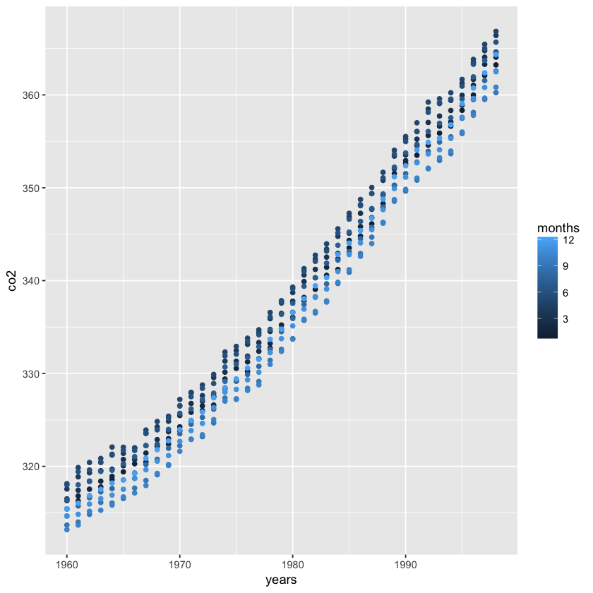
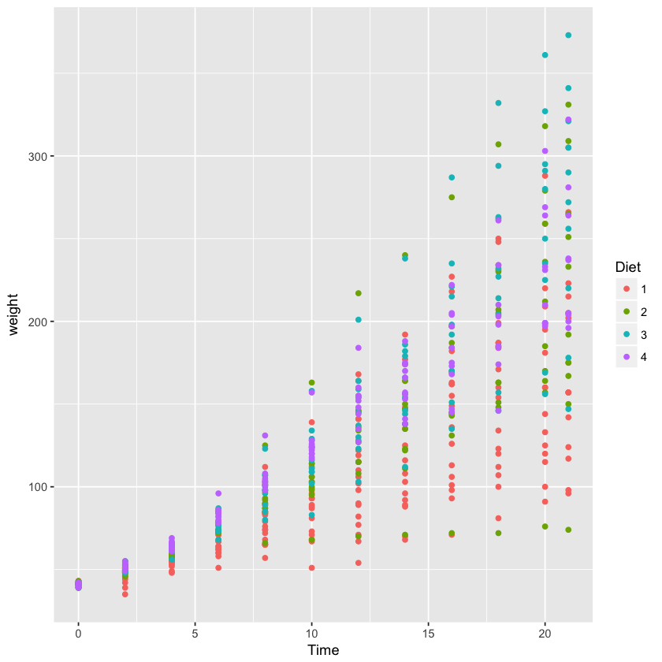
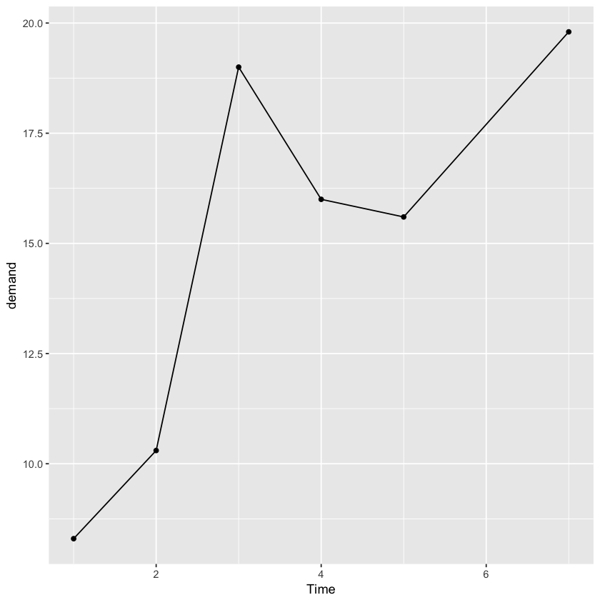

## Exercises

>1. Examine the dataset `co2`. Which of the following is true:

>    A. `co2` is tidy data: it has one year for each row.

>    B. `co2` is not tidy: we need at least one column with a character vector.

>    C. `co2` is not tidy:  it is a matrix not a data frame.

>    __D__. `co2` is not tidy: to be tidy we would have to wrangle it to have three columns: year, month and value; then each co2 observation has a row.

Definition of `tidy data` from this chapter is as follows: *each row represents one observation and the columns represent the different variables available for each of these observations* 

According to this defintion the time-series object does not define a tidy data set, because it is not defined wich observation belongs to which point in time. Therefore, answer **D** is the most likely one. The calculations below show that the object `Time-Series` contains 468 data points for each month for 39 years between 1959 and 1998, which are 468 points total.


```R
library(tidyverse)
```

    ── Attaching packages ─────────────────────────────────────── tidyverse 1.2.1 ──
    ✔ ggplot2 2.2.1     ✔ purrr   0.2.5
    ✔ tibble  1.4.2     ✔ dplyr   0.7.6
    ✔ tidyr   0.8.1     ✔ stringr 1.3.1
    ✔ readr   1.1.1     ✔ forcats 0.3.0
    ── Conflicts ────────────────────────────────────────── tidyverse_conflicts() ──
    ✖ dplyr::filter() masks stats::filter()
    ✖ dplyr::lag()    masks stats::lag()


```R
library(dslabs)
```


```R
data("co2")
```


```R
str(co2)
```

     Time-Series [1:468] from 1959 to 1998: 315 316 316 318 318 ...


```R
length(co2)
```


468


```R
(1998-1959)*12
```


468


```R
months <- rep(1:12,39)
```


```R
years <- rep(1960:1998,12)
```


```R
years <- sort(years)
```


```R
tab_co2 <- as.tibble(cbind(years,months,co2)) %>% arrange(years,months)
```


```R
tab_co2 %>% ggplot(aes(years,co2,col=months)) + geom_point()
```





>2. Examine the dataset  `ChickWeight`. Which of the following is true:

>    A.  `ChickWeight` is not tidy: each chick has more than one row. 

>    __B__.  `ChickWeight` is tidy: each observation, here a weight, is represented by one row. The chick from which this measurement came from is one the variables.

>    C.  `ChickWeight` is not a tidy: we are missing the year column.

>    D.  `ChickWeight` is tidy: it is stored in a data frame.


```R
data(ChickWeight)
```


```R
ChickWeight
```


<table>
<thead><tr><th scope=col>weight</th><th scope=col>Time</th><th scope=col>Chick</th><th scope=col>Diet</th></tr></thead>
<tbody>
	<tr><td> 42</td><td> 0 </td><td>1  </td><td>1  </td></tr>
	<tr><td> 51</td><td> 2 </td><td>1  </td><td>1  </td></tr>
	<tr><td> 59</td><td> 4 </td><td>1  </td><td>1  </td></tr>
	<tr><td> 64</td><td> 6 </td><td>1  </td><td>1  </td></tr>
	<tr><td> 76</td><td> 8 </td><td>1  </td><td>1  </td></tr>
	<tr><td> 93</td><td>10 </td><td>1  </td><td>1  </td></tr>
	<tr><td>106</td><td>12 </td><td>1  </td><td>1  </td></tr>
	<tr><td>125</td><td>14 </td><td>1  </td><td>1  </td></tr>
	<tr><td>149</td><td>16 </td><td>1  </td><td>1  </td></tr>
	<tr><td>171</td><td>18 </td><td>1  </td><td>1  </td></tr>
	<tr><td>199</td><td>20 </td><td>1  </td><td>1  </td></tr>
	<tr><td>205</td><td>21 </td><td>1  </td><td>1  </td></tr>
	<tr><td> 40</td><td> 0 </td><td>2  </td><td>1  </td></tr>
	<tr><td> 49</td><td> 2 </td><td>2  </td><td>1  </td></tr>
	<tr><td> 58</td><td> 4 </td><td>2  </td><td>1  </td></tr>
	<tr><td> 72</td><td> 6 </td><td>2  </td><td>1  </td></tr>
	<tr><td> 84</td><td> 8 </td><td>2  </td><td>1  </td></tr>
	<tr><td>103</td><td>10 </td><td>2  </td><td>1  </td></tr>
	<tr><td>122</td><td>12 </td><td>2  </td><td>1  </td></tr>
	<tr><td>138</td><td>14 </td><td>2  </td><td>1  </td></tr>
	<tr><td>162</td><td>16 </td><td>2  </td><td>1  </td></tr>
	<tr><td>187</td><td>18 </td><td>2  </td><td>1  </td></tr>
	<tr><td>209</td><td>20 </td><td>2  </td><td>1  </td></tr>
	<tr><td>215</td><td>21 </td><td>2  </td><td>1  </td></tr>
	<tr><td> 43</td><td> 0 </td><td>3  </td><td>1  </td></tr>
	<tr><td> 39</td><td> 2 </td><td>3  </td><td>1  </td></tr>
	<tr><td> 55</td><td> 4 </td><td>3  </td><td>1  </td></tr>
	<tr><td> 67</td><td> 6 </td><td>3  </td><td>1  </td></tr>
	<tr><td> 84</td><td> 8 </td><td>3  </td><td>1  </td></tr>
	<tr><td> 99</td><td>10 </td><td>3  </td><td>1  </td></tr>
	<tr><td>⋮</td><td>⋮</td><td>⋮</td><td>⋮</td></tr>
	<tr><td>154</td><td>12 </td><td>48 </td><td>4  </td></tr>
	<tr><td>170</td><td>14 </td><td>48 </td><td>4  </td></tr>
	<tr><td>222</td><td>16 </td><td>48 </td><td>4  </td></tr>
	<tr><td>261</td><td>18 </td><td>48 </td><td>4  </td></tr>
	<tr><td>303</td><td>20 </td><td>48 </td><td>4  </td></tr>
	<tr><td>322</td><td>21 </td><td>48 </td><td>4  </td></tr>
	<tr><td> 40</td><td> 0 </td><td>49 </td><td>4  </td></tr>
	<tr><td> 53</td><td> 2 </td><td>49 </td><td>4  </td></tr>
	<tr><td> 64</td><td> 4 </td><td>49 </td><td>4  </td></tr>
	<tr><td> 85</td><td> 6 </td><td>49 </td><td>4  </td></tr>
	<tr><td>108</td><td> 8 </td><td>49 </td><td>4  </td></tr>
	<tr><td>128</td><td>10 </td><td>49 </td><td>4  </td></tr>
	<tr><td>152</td><td>12 </td><td>49 </td><td>4  </td></tr>
	<tr><td>166</td><td>14 </td><td>49 </td><td>4  </td></tr>
	<tr><td>184</td><td>16 </td><td>49 </td><td>4  </td></tr>
	<tr><td>203</td><td>18 </td><td>49 </td><td>4  </td></tr>
	<tr><td>233</td><td>20 </td><td>49 </td><td>4  </td></tr>
	<tr><td>237</td><td>21 </td><td>49 </td><td>4  </td></tr>
	<tr><td> 41</td><td> 0 </td><td>50 </td><td>4  </td></tr>
	<tr><td> 54</td><td> 2 </td><td>50 </td><td>4  </td></tr>
	<tr><td> 67</td><td> 4 </td><td>50 </td><td>4  </td></tr>
	<tr><td> 84</td><td> 6 </td><td>50 </td><td>4  </td></tr>
	<tr><td>105</td><td> 8 </td><td>50 </td><td>4  </td></tr>
	<tr><td>122</td><td>10 </td><td>50 </td><td>4  </td></tr>
	<tr><td>155</td><td>12 </td><td>50 </td><td>4  </td></tr>
	<tr><td>175</td><td>14 </td><td>50 </td><td>4  </td></tr>
	<tr><td>205</td><td>16 </td><td>50 </td><td>4  </td></tr>
	<tr><td>234</td><td>18 </td><td>50 </td><td>4  </td></tr>
	<tr><td>264</td><td>20 </td><td>50 </td><td>4  </td></tr>
	<tr><td>264</td><td>21 </td><td>50 </td><td>4  </td></tr>
</tbody>
</table>


```R
str(ChickWeight)
```

    Classes ‘nfnGroupedData’, ‘nfGroupedData’, ‘groupedData’ and 'data.frame':	578 obs. of  4 variables:
     $ weight: num  42 51 59 64 76 93 106 125 149 171 ...
     $ Time  : num  0 2 4 6 8 10 12 14 16 18 ...
     $ Chick : Ord.factor w/ 50 levels "18"<"16"<"15"<..: 15 15 15 15 15 15 15 15 15 15 ...
     $ Diet  : Factor w/ 4 levels "1","2","3","4": 1 1 1 1 1 1 1 1 1 1 ...
     - attr(*, "formula")=Class 'formula'  language weight ~ Time | Chick
      .. ..- attr(*, ".Environment")=<environment: R_EmptyEnv> 
     - attr(*, "outer")=Class 'formula'  language ~Diet
      .. ..- attr(*, ".Environment")=<environment: R_EmptyEnv> 
     - attr(*, "labels")=List of 2
      ..$ x: chr "Time"
      ..$ y: chr "Body weight"
     - attr(*, "units")=List of 2
      ..$ x: chr "(days)"
      ..$ y: chr "(gm)"


```R
class(ChickWeight)
```


<ol class=list-inline>
	<li>'nfnGroupedData'</li>
	<li>'nfGroupedData'</li>
	<li>'groupedData'</li>
	<li>'data.frame'</li>
</ol>


```R
ChickWeight %>% ggplot(aes(Time,weight,col=Diet)) + geom_point()
```





>3. Examine the dataset `BOD`. Which of the following is true:

>    A. `BOD` is not tidy: it only has six rows.

>    B. `BOD` is not tidy: the first column is just an index.

>    __C__. `BOD` is tidy: each row is an observation with two values, time and demand.

>    D. `BOD` is tidy: all small datasets are tidy by definition.


```R
data(BOD)
```


```R
BOD
```


<table>
<thead><tr><th scope=col>Time</th><th scope=col>demand</th></tr></thead>
<tbody>
	<tr><td>1   </td><td> 8.3</td></tr>
	<tr><td>2   </td><td>10.3</td></tr>
	<tr><td>3   </td><td>19.0</td></tr>
	<tr><td>4   </td><td>16.0</td></tr>
	<tr><td>5   </td><td>15.6</td></tr>
	<tr><td>7   </td><td>19.8</td></tr>
</tbody>
</table>


```R
BOD %>% ggplot(aes(Time,demand)) + geom_line() + geom_point()
```





>4. Which of the following datasets is tidy (you can pick more than one):

>    A. `BJsales`

>    B. `EuStockMarkets`

>    C. `DNase`

>    D. `Formaldehyde`

>    E. `Orange`

>    F. `UCBAdmissions`


```R
data(BJsales)
```


```R
str(BJsales)
```

     Time-Series [1:150] from 1 to 150: 200 200 199 199 199 ...


```R
data(EuStockMarkets)
```


```R
str(EuStockMarkets)
```

     Time-Series [1:1860, 1:4] from 1991 to 1999: 1629 1614 1607 1621 1618 ...
     - attr(*, "dimnames")=List of 2
      ..$ : NULL
      ..$ : chr [1:4] "DAX" "SMI" "CAC" "FTSE"


```R
data(DNase)
```


```R
str(DNase)
```

    Classes ‘nfnGroupedData’, ‘nfGroupedData’, ‘groupedData’ and 'data.frame':	176 obs. of  3 variables:
     $ Run    : Ord.factor w/ 11 levels "10"<"11"<"9"<..: 4 4 4 4 4 4 4 4 4 4 ...
     $ conc   : num  0.0488 0.0488 0.1953 0.1953 0.3906 ...
     $ density: num  0.017 0.018 0.121 0.124 0.206 0.215 0.377 0.374 0.614 0.609 ...
     - attr(*, "formula")=Class 'formula'  language density ~ conc | Run
      .. ..- attr(*, ".Environment")=<environment: R_EmptyEnv> 
     - attr(*, "labels")=List of 2
      ..$ x: chr "DNase concentration"
      ..$ y: chr "Optical density"
     - attr(*, "units")=List of 1
      ..$ x: chr "(ng/ml)"


```R
DNase
```


<table>
<thead><tr><th scope=col>Run</th><th scope=col>conc</th><th scope=col>density</th></tr></thead>
<tbody>
	<tr><td>1          </td><td> 0.04882812</td><td>0.017      </td></tr>
	<tr><td>1          </td><td> 0.04882812</td><td>0.018      </td></tr>
	<tr><td>1          </td><td> 0.19531250</td><td>0.121      </td></tr>
	<tr><td>1          </td><td> 0.19531250</td><td>0.124      </td></tr>
	<tr><td>1          </td><td> 0.39062500</td><td>0.206      </td></tr>
	<tr><td>1          </td><td> 0.39062500</td><td>0.215      </td></tr>
	<tr><td>1          </td><td> 0.78125000</td><td>0.377      </td></tr>
	<tr><td>1          </td><td> 0.78125000</td><td>0.374      </td></tr>
	<tr><td>1          </td><td> 1.56250000</td><td>0.614      </td></tr>
	<tr><td>1          </td><td> 1.56250000</td><td>0.609      </td></tr>
	<tr><td>1          </td><td> 3.12500000</td><td>1.019      </td></tr>
	<tr><td>1          </td><td> 3.12500000</td><td>1.001      </td></tr>
	<tr><td>1          </td><td> 6.25000000</td><td>1.334      </td></tr>
	<tr><td>1          </td><td> 6.25000000</td><td>1.364      </td></tr>
	<tr><td>1          </td><td>12.50000000</td><td>1.730      </td></tr>
	<tr><td>1          </td><td>12.50000000</td><td>1.710      </td></tr>
	<tr><td>2          </td><td> 0.04882812</td><td>0.045      </td></tr>
	<tr><td>2          </td><td> 0.04882812</td><td>0.050      </td></tr>
	<tr><td>2          </td><td> 0.19531250</td><td>0.137      </td></tr>
	<tr><td>2          </td><td> 0.19531250</td><td>0.123      </td></tr>
	<tr><td>2          </td><td> 0.39062500</td><td>0.225      </td></tr>
	<tr><td>2          </td><td> 0.39062500</td><td>0.207      </td></tr>
	<tr><td>2          </td><td> 0.78125000</td><td>0.401      </td></tr>
	<tr><td>2          </td><td> 0.78125000</td><td>0.383      </td></tr>
	<tr><td>2          </td><td> 1.56250000</td><td>0.672      </td></tr>
	<tr><td>2          </td><td> 1.56250000</td><td>0.681      </td></tr>
	<tr><td>2          </td><td> 3.12500000</td><td>1.116      </td></tr>
	<tr><td>2          </td><td> 3.12500000</td><td>1.078      </td></tr>
	<tr><td>2          </td><td> 6.25000000</td><td>1.554      </td></tr>
	<tr><td>2          </td><td> 6.25000000</td><td>1.526      </td></tr>
	<tr><td>⋮</td><td>⋮</td><td>⋮</td></tr>
	<tr><td>10         </td><td> 0.19531250</td><td>0.164      </td></tr>
	<tr><td>10         </td><td> 0.19531250</td><td>0.166      </td></tr>
	<tr><td>10         </td><td> 0.39062500</td><td>0.259      </td></tr>
	<tr><td>10         </td><td> 0.39062500</td><td>0.256      </td></tr>
	<tr><td>10         </td><td> 0.78125000</td><td>0.439      </td></tr>
	<tr><td>10         </td><td> 0.78125000</td><td>0.439      </td></tr>
	<tr><td>10         </td><td> 1.56250000</td><td>0.690      </td></tr>
	<tr><td>10         </td><td> 1.56250000</td><td>0.701      </td></tr>
	<tr><td>10         </td><td> 3.12500000</td><td>1.042      </td></tr>
	<tr><td>10         </td><td> 3.12500000</td><td>1.075      </td></tr>
	<tr><td>10         </td><td> 6.25000000</td><td>1.340      </td></tr>
	<tr><td>10         </td><td> 6.25000000</td><td>1.406      </td></tr>
	<tr><td>10         </td><td>12.50000000</td><td>1.699      </td></tr>
	<tr><td>10         </td><td>12.50000000</td><td>1.708      </td></tr>
	<tr><td>11         </td><td> 0.04882812</td><td>0.047      </td></tr>
	<tr><td>11         </td><td> 0.04882812</td><td>0.057      </td></tr>
	<tr><td>11         </td><td> 0.19531250</td><td>0.159      </td></tr>
	<tr><td>11         </td><td> 0.19531250</td><td>0.155      </td></tr>
	<tr><td>11         </td><td> 0.39062500</td><td>0.246      </td></tr>
	<tr><td>11         </td><td> 0.39062500</td><td>0.252      </td></tr>
	<tr><td>11         </td><td> 0.78125000</td><td>0.427      </td></tr>
	<tr><td>11         </td><td> 0.78125000</td><td>0.411      </td></tr>
	<tr><td>11         </td><td> 1.56250000</td><td>0.704      </td></tr>
	<tr><td>11         </td><td> 1.56250000</td><td>0.684      </td></tr>
	<tr><td>11         </td><td> 3.12500000</td><td>0.994      </td></tr>
	<tr><td>11         </td><td> 3.12500000</td><td>0.980      </td></tr>
	<tr><td>11         </td><td> 6.25000000</td><td>1.421      </td></tr>
	<tr><td>11         </td><td> 6.25000000</td><td>1.385      </td></tr>
	<tr><td>11         </td><td>12.50000000</td><td>1.715      </td></tr>
	<tr><td>11         </td><td>12.50000000</td><td>1.721      </td></tr>
</tbody>
</table>


```R
data(Formaldehyde)
```


```R
str(Formaldehyde)
```

    'data.frame':	6 obs. of  2 variables:
     $ carb  : num  0.1 0.3 0.5 0.6 0.7 0.9
     $ optden: num  0.086 0.269 0.446 0.538 0.626 0.782


```R
Formaldehyde
```


<table>
<thead><tr><th scope=col>carb</th><th scope=col>optden</th></tr></thead>
<tbody>
	<tr><td>0.1  </td><td>0.086</td></tr>
	<tr><td>0.3  </td><td>0.269</td></tr>
	<tr><td>0.5  </td><td>0.446</td></tr>
	<tr><td>0.6  </td><td>0.538</td></tr>
	<tr><td>0.7  </td><td>0.626</td></tr>
	<tr><td>0.9  </td><td>0.782</td></tr>
</tbody>
</table>


```R
data(Orange)
```


```R
str(Orange)
```

    Classes ‘nfnGroupedData’, ‘nfGroupedData’, ‘groupedData’ and 'data.frame':	35 obs. of  3 variables:
     $ Tree         : Ord.factor w/ 5 levels "3"<"1"<"5"<"2"<..: 2 2 2 2 2 2 2 4 4 4 ...
     $ age          : num  118 484 664 1004 1231 ...
     $ circumference: num  30 58 87 115 120 142 145 33 69 111 ...
     - attr(*, "formula")=Class 'formula'  language circumference ~ age | Tree
      .. ..- attr(*, ".Environment")=<environment: R_EmptyEnv> 
     - attr(*, "labels")=List of 2
      ..$ x: chr "Time since December 31, 1968"
      ..$ y: chr "Trunk circumference"
     - attr(*, "units")=List of 2
      ..$ x: chr "(days)"
      ..$ y: chr "(mm)"


```R
Orange
```


<table>
<thead><tr><th scope=col>Tree</th><th scope=col>age</th><th scope=col>circumference</th></tr></thead>
<tbody>
	<tr><td>1   </td><td> 118</td><td> 30 </td></tr>
	<tr><td>1   </td><td> 484</td><td> 58 </td></tr>
	<tr><td>1   </td><td> 664</td><td> 87 </td></tr>
	<tr><td>1   </td><td>1004</td><td>115 </td></tr>
	<tr><td>1   </td><td>1231</td><td>120 </td></tr>
	<tr><td>1   </td><td>1372</td><td>142 </td></tr>
	<tr><td>1   </td><td>1582</td><td>145 </td></tr>
	<tr><td>2   </td><td> 118</td><td> 33 </td></tr>
	<tr><td>2   </td><td> 484</td><td> 69 </td></tr>
	<tr><td>2   </td><td> 664</td><td>111 </td></tr>
	<tr><td>2   </td><td>1004</td><td>156 </td></tr>
	<tr><td>2   </td><td>1231</td><td>172 </td></tr>
	<tr><td>2   </td><td>1372</td><td>203 </td></tr>
	<tr><td>2   </td><td>1582</td><td>203 </td></tr>
	<tr><td>3   </td><td> 118</td><td> 30 </td></tr>
	<tr><td>3   </td><td> 484</td><td> 51 </td></tr>
	<tr><td>3   </td><td> 664</td><td> 75 </td></tr>
	<tr><td>3   </td><td>1004</td><td>108 </td></tr>
	<tr><td>3   </td><td>1231</td><td>115 </td></tr>
	<tr><td>3   </td><td>1372</td><td>139 </td></tr>
	<tr><td>3   </td><td>1582</td><td>140 </td></tr>
	<tr><td>4   </td><td> 118</td><td> 32 </td></tr>
	<tr><td>4   </td><td> 484</td><td> 62 </td></tr>
	<tr><td>4   </td><td> 664</td><td>112 </td></tr>
	<tr><td>4   </td><td>1004</td><td>167 </td></tr>
	<tr><td>4   </td><td>1231</td><td>179 </td></tr>
	<tr><td>4   </td><td>1372</td><td>209 </td></tr>
	<tr><td>4   </td><td>1582</td><td>214 </td></tr>
	<tr><td>5   </td><td> 118</td><td> 30 </td></tr>
	<tr><td>5   </td><td> 484</td><td> 49 </td></tr>
	<tr><td>5   </td><td> 664</td><td> 81 </td></tr>
	<tr><td>5   </td><td>1004</td><td>125 </td></tr>
	<tr><td>5   </td><td>1231</td><td>142 </td></tr>
	<tr><td>5   </td><td>1372</td><td>174 </td></tr>
	<tr><td>5   </td><td>1582</td><td>177 </td></tr>
</tbody>
</table>


```R
data(UCBAdmissions)
```


```R
str(UCBAdmissions)
```

     'table' num [1:2, 1:2, 1:6] 512 313 89 19 353 207 17 8 120 205 ...
     - attr(*, "dimnames")=List of 3
      ..$ Admit : chr [1:2] "Admitted" "Rejected"
      ..$ Gender: chr [1:2] "Male" "Female"
      ..$ Dept  : chr [1:6] "A" "B" "C" "D" ...


```R
UCBAdmissions
```


    , , Dept = A
    
              Gender
    Admit      Male Female
      Admitted  512     89
      Rejected  313     19
    
    , , Dept = B
    
              Gender
    Admit      Male Female
      Admitted  353     17
      Rejected  207      8
    
    , , Dept = C
    
              Gender
    Admit      Male Female
      Admitted  120    202
      Rejected  205    391
    
    , , Dept = D
    
              Gender
    Admit      Male Female
      Admitted  138    131
      Rejected  279    244
    
    , , Dept = E
    
              Gender
    Admit      Male Female
      Admitted   53     94
      Rejected  138    299
    
    , , Dept = F
    
              Gender
    Admit      Male Female
      Admitted   22     24
      Rejected  351    317


