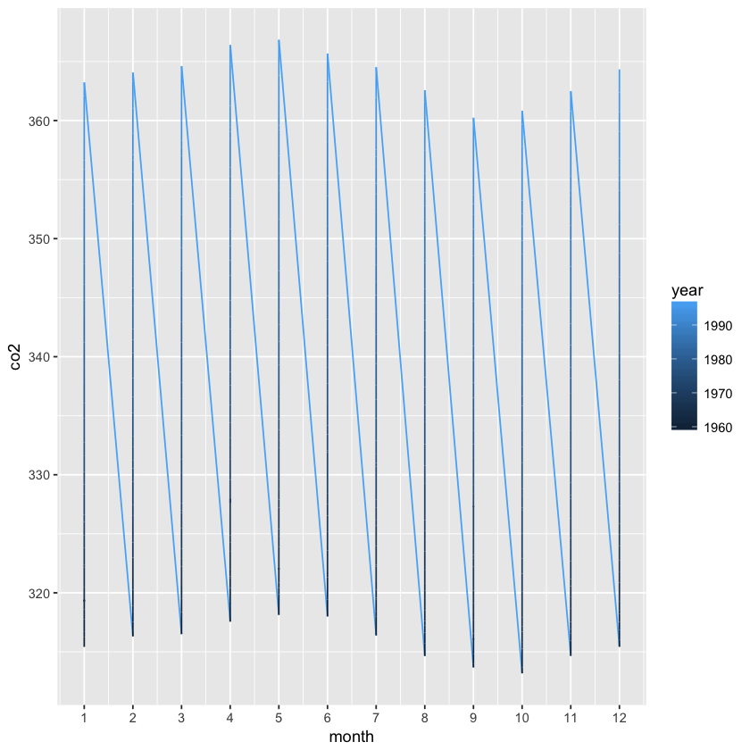
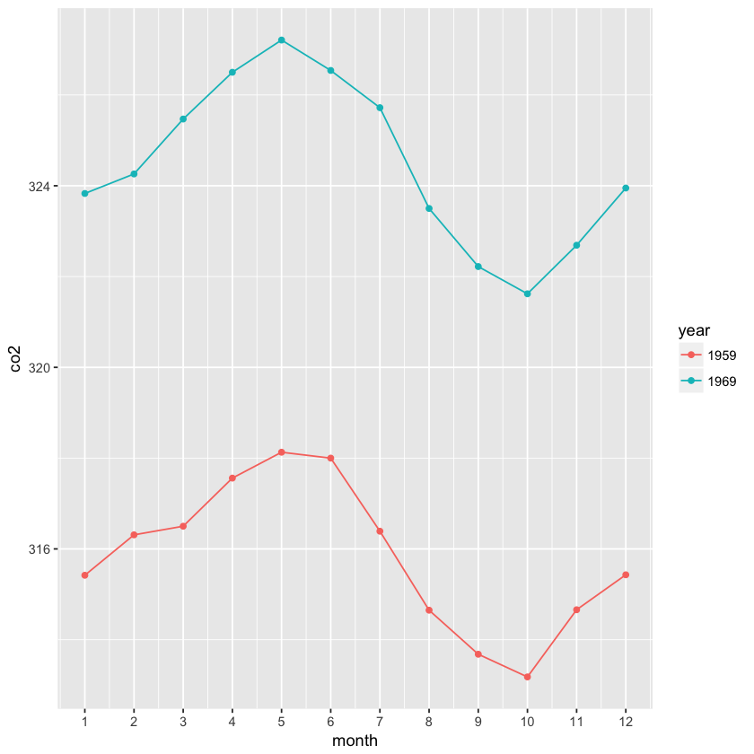

## Exercises ch 36 reshaping data


```R
library(tidyverse)
```

    ── Attaching packages ─────────────────────────────────────── tidyverse 1.2.1 ──
    ✔ ggplot2 2.2.1     ✔ purrr   0.2.5
    ✔ tibble  1.4.2     ✔ dplyr   0.7.6
    ✔ tidyr   0.8.1     ✔ stringr 1.3.1
    ✔ readr   1.1.1     ✔ forcats 0.3.0
    ── Conflicts ────────────────────────────────────────── tidyverse_conflicts() ──
    ✖ dplyr::filter() masks stats::filter()
    ✖ dplyr::lag()    masks stats::lag()


>1. Run the following command to define the `co2_wide` object:
>
>    ```R
>    co2_wide <- data.frame(matrix(co2, ncol = 12, byrow = TRUE)) %>% 
>      setNames(1:12) %>%
>      mutate(year = as.character(1959:1997))
>    ```
>
>    Use the `gather` function to wrangle this into a tidy dataset. Call the column with the CO2 measurements `co2` and call the month column `month`. Call the     resulting object `co2_tidy`.


```R
str(co2)
```

     Time-Series [1:468] from 1959 to 1998: 315 316 316 318 318 ...


```R
data.frame(matrix(co2, ncol = 12, byrow = TRUE)) %>% setNames(1:12) %>% mutate(year=as.character(1959:1997))
```


<table>
<thead><tr><th scope=col>1</th><th scope=col>2</th><th scope=col>3</th><th scope=col>4</th><th scope=col>5</th><th scope=col>6</th><th scope=col>7</th><th scope=col>8</th><th scope=col>9</th><th scope=col>10</th><th scope=col>11</th><th scope=col>12</th><th scope=col>year</th></tr></thead>
<tbody>
	<tr><td>315.42</td><td>316.31</td><td>316.50</td><td>317.56</td><td>318.13</td><td>318.00</td><td>316.39</td><td>314.65</td><td>313.68</td><td>313.18</td><td>314.66</td><td>315.43</td><td>1959  </td></tr>
	<tr><td>316.27</td><td>316.81</td><td>317.42</td><td>318.87</td><td>319.87</td><td>319.43</td><td>318.01</td><td>315.74</td><td>314.00</td><td>313.68</td><td>314.84</td><td>316.03</td><td>1960  </td></tr>
	<tr><td>316.73</td><td>317.54</td><td>318.38</td><td>319.31</td><td>320.42</td><td>319.61</td><td>318.42</td><td>316.63</td><td>314.83</td><td>315.16</td><td>315.94</td><td>316.85</td><td>1961  </td></tr>
	<tr><td>317.78</td><td>318.40</td><td>319.53</td><td>320.42</td><td>320.85</td><td>320.45</td><td>319.45</td><td>317.25</td><td>316.11</td><td>315.27</td><td>316.53</td><td>317.53</td><td>1962  </td></tr>
	<tr><td>318.58</td><td>318.92</td><td>319.70</td><td>321.22</td><td>322.08</td><td>321.31</td><td>319.58</td><td>317.61</td><td>316.05</td><td>315.83</td><td>316.91</td><td>318.20</td><td>1963  </td></tr>
	<tr><td>319.41</td><td>320.07</td><td>320.74</td><td>321.40</td><td>322.06</td><td>321.73</td><td>320.27</td><td>318.54</td><td>316.54</td><td>316.71</td><td>317.53</td><td>318.55</td><td>1964  </td></tr>
	<tr><td>319.27</td><td>320.28</td><td>320.73</td><td>321.97</td><td>322.00</td><td>321.71</td><td>321.05</td><td>318.71</td><td>317.66</td><td>317.14</td><td>318.70</td><td>319.25</td><td>1965  </td></tr>
	<tr><td>320.46</td><td>321.43</td><td>322.23</td><td>323.54</td><td>323.91</td><td>323.59</td><td>322.24</td><td>320.20</td><td>318.48</td><td>317.94</td><td>319.63</td><td>320.87</td><td>1966  </td></tr>
	<tr><td>322.17</td><td>322.34</td><td>322.88</td><td>324.25</td><td>324.83</td><td>323.93</td><td>322.38</td><td>320.76</td><td>319.10</td><td>319.24</td><td>320.56</td><td>321.80</td><td>1967  </td></tr>
	<tr><td>322.40</td><td>322.99</td><td>323.73</td><td>324.86</td><td>325.40</td><td>325.20</td><td>323.98</td><td>321.95</td><td>320.18</td><td>320.09</td><td>321.16</td><td>322.74</td><td>1968  </td></tr>
	<tr><td>323.83</td><td>324.26</td><td>325.47</td><td>326.50</td><td>327.21</td><td>326.54</td><td>325.72</td><td>323.50</td><td>322.22</td><td>321.62</td><td>322.69</td><td>323.95</td><td>1969  </td></tr>
	<tr><td>324.89</td><td>325.82</td><td>326.77</td><td>327.97</td><td>327.91</td><td>327.50</td><td>326.18</td><td>324.53</td><td>322.93</td><td>322.90</td><td>323.85</td><td>324.96</td><td>1970  </td></tr>
	<tr><td>326.01</td><td>326.51</td><td>327.01</td><td>327.62</td><td>328.76</td><td>328.40</td><td>327.20</td><td>325.27</td><td>323.20</td><td>323.40</td><td>324.63</td><td>325.85</td><td>1971  </td></tr>
	<tr><td>326.60</td><td>327.47</td><td>327.58</td><td>329.56</td><td>329.90</td><td>328.92</td><td>327.88</td><td>326.16</td><td>324.68</td><td>325.04</td><td>326.34</td><td>327.39</td><td>1972  </td></tr>
	<tr><td>328.37</td><td>329.40</td><td>330.14</td><td>331.33</td><td>332.31</td><td>331.90</td><td>330.70</td><td>329.15</td><td>327.35</td><td>327.02</td><td>327.99</td><td>328.48</td><td>1973  </td></tr>
	<tr><td>329.18</td><td>330.55</td><td>331.32</td><td>332.48</td><td>332.92</td><td>332.08</td><td>331.01</td><td>329.23</td><td>327.27</td><td>327.21</td><td>328.29</td><td>329.41</td><td>1974  </td></tr>
	<tr><td>330.23</td><td>331.25</td><td>331.87</td><td>333.14</td><td>333.80</td><td>333.43</td><td>331.73</td><td>329.90</td><td>328.40</td><td>328.17</td><td>329.32</td><td>330.59</td><td>1975  </td></tr>
	<tr><td>331.58</td><td>332.39</td><td>333.33</td><td>334.41</td><td>334.71</td><td>334.17</td><td>332.89</td><td>330.77</td><td>329.14</td><td>328.78</td><td>330.14</td><td>331.52</td><td>1976  </td></tr>
	<tr><td>332.75</td><td>333.24</td><td>334.53</td><td>335.90</td><td>336.57</td><td>336.10</td><td>334.76</td><td>332.59</td><td>331.42</td><td>330.98</td><td>332.24</td><td>333.68</td><td>1977  </td></tr>
	<tr><td>334.80</td><td>335.22</td><td>336.47</td><td>337.59</td><td>337.84</td><td>337.72</td><td>336.37</td><td>334.51</td><td>332.60</td><td>332.38</td><td>333.75</td><td>334.78</td><td>1978  </td></tr>
	<tr><td>336.05</td><td>336.59</td><td>337.79</td><td>338.71</td><td>339.30</td><td>339.12</td><td>337.56</td><td>335.92</td><td>333.75</td><td>333.70</td><td>335.12</td><td>336.56</td><td>1979  </td></tr>
	<tr><td>337.84</td><td>338.19</td><td>339.91</td><td>340.60</td><td>341.29</td><td>341.00</td><td>339.39</td><td>337.43</td><td>335.72</td><td>335.84</td><td>336.93</td><td>338.04</td><td>1980  </td></tr>
	<tr><td>339.06</td><td>340.30</td><td>341.21</td><td>342.33</td><td>342.74</td><td>342.08</td><td>340.32</td><td>338.26</td><td>336.52</td><td>336.68</td><td>338.19</td><td>339.44</td><td>1981  </td></tr>
	<tr><td>340.57</td><td>341.44</td><td>342.53</td><td>343.39</td><td>343.96</td><td>343.18</td><td>341.88</td><td>339.65</td><td>337.81</td><td>337.69</td><td>339.09</td><td>340.32</td><td>1982  </td></tr>
	<tr><td>341.20</td><td>342.35</td><td>342.93</td><td>344.77</td><td>345.58</td><td>345.14</td><td>343.81</td><td>342.21</td><td>339.69</td><td>339.82</td><td>340.98</td><td>342.82</td><td>1983  </td></tr>
	<tr><td>343.52</td><td>344.33</td><td>345.11</td><td>346.88</td><td>347.25</td><td>346.62</td><td>345.22</td><td>343.11</td><td>340.90</td><td>341.18</td><td>342.80</td><td>344.04</td><td>1984  </td></tr>
	<tr><td>344.79</td><td>345.82</td><td>347.25</td><td>348.17</td><td>348.74</td><td>348.07</td><td>346.38</td><td>344.51</td><td>342.92</td><td>342.62</td><td>344.06</td><td>345.38</td><td>1985  </td></tr>
	<tr><td>346.11</td><td>346.78</td><td>347.68</td><td>349.37</td><td>350.03</td><td>349.37</td><td>347.76</td><td>345.73</td><td>344.68</td><td>343.99</td><td>345.48</td><td>346.72</td><td>1986  </td></tr>
	<tr><td>347.84</td><td>348.29</td><td>349.23</td><td>350.80</td><td>351.66</td><td>351.07</td><td>349.33</td><td>347.92</td><td>346.27</td><td>346.18</td><td>347.64</td><td>348.78</td><td>1987  </td></tr>
	<tr><td>350.25</td><td>351.54</td><td>352.05</td><td>353.41</td><td>354.04</td><td>353.62</td><td>352.22</td><td>350.27</td><td>348.55</td><td>348.72</td><td>349.91</td><td>351.18</td><td>1988  </td></tr>
	<tr><td>352.60</td><td>352.92</td><td>353.53</td><td>355.26</td><td>355.52</td><td>354.97</td><td>353.75</td><td>351.52</td><td>349.64</td><td>349.83</td><td>351.14</td><td>352.37</td><td>1989  </td></tr>
	<tr><td>353.50</td><td>354.55</td><td>355.23</td><td>356.04</td><td>357.00</td><td>356.07</td><td>354.67</td><td>352.76</td><td>350.82</td><td>351.04</td><td>352.69</td><td>354.07</td><td>1990  </td></tr>
	<tr><td>354.59</td><td>355.63</td><td>357.03</td><td>358.48</td><td>359.22</td><td>358.12</td><td>356.06</td><td>353.92</td><td>352.05</td><td>352.11</td><td>353.64</td><td>354.89</td><td>1991  </td></tr>
	<tr><td>355.88</td><td>356.63</td><td>357.72</td><td>359.07</td><td>359.58</td><td>359.17</td><td>356.94</td><td>354.92</td><td>352.94</td><td>353.23</td><td>354.09</td><td>355.33</td><td>1992  </td></tr>
	<tr><td>356.63</td><td>357.10</td><td>358.32</td><td>359.41</td><td>360.23</td><td>359.55</td><td>357.53</td><td>355.48</td><td>353.67</td><td>353.95</td><td>355.30</td><td>356.78</td><td>1993  </td></tr>
	<tr><td>358.34</td><td>358.89</td><td>359.95</td><td>361.25</td><td>361.67</td><td>360.94</td><td>359.55</td><td>357.49</td><td>355.84</td><td>356.00</td><td>357.59</td><td>359.05</td><td>1994  </td></tr>
	<tr><td>359.98</td><td>361.03</td><td>361.66</td><td>363.48</td><td>363.82</td><td>363.30</td><td>361.94</td><td>359.50</td><td>358.11</td><td>357.80</td><td>359.61</td><td>360.74</td><td>1995  </td></tr>
	<tr><td>362.09</td><td>363.29</td><td>364.06</td><td>364.76</td><td>365.45</td><td>365.01</td><td>363.70</td><td>361.54</td><td>359.51</td><td>359.65</td><td>360.80</td><td>362.38</td><td>1996  </td></tr>
	<tr><td>363.23</td><td>364.06</td><td>364.61</td><td>366.40</td><td>366.84</td><td>365.68</td><td>364.52</td><td>362.57</td><td>360.24</td><td>360.83</td><td>362.49</td><td>364.34</td><td>1997  </td></tr>
</tbody>
</table>


```R
co2_tidy <- data.frame(matrix(co2, ncol = 12, byrow = TRUE)) %>% setNames(1:12) %>% mutate(year=as.numeric(1959:1997)) %>% gather(key=month, value=co2, -year, convert=TRUE) 
```


```R
str(co2_tidy)
```

    'data.frame':	468 obs. of  3 variables:
     $ year : num  1959 1960 1961 1962 1963 ...
     $ month: int  1 1 1 1 1 1 1 1 1 1 ...
     $ co2  : num  315 316 317 318 319 ...


```R
co2_tidy
```


<table>
<thead><tr><th scope=col>year</th><th scope=col>month</th><th scope=col>co2</th></tr></thead>
<tbody>
	<tr><td>1959  </td><td>1     </td><td>315.42</td></tr>
	<tr><td>1960  </td><td>1     </td><td>316.27</td></tr>
	<tr><td>1961  </td><td>1     </td><td>316.73</td></tr>
	<tr><td>1962  </td><td>1     </td><td>317.78</td></tr>
	<tr><td>1963  </td><td>1     </td><td>318.58</td></tr>
	<tr><td>1964  </td><td>1     </td><td>319.41</td></tr>
	<tr><td>1965  </td><td>1     </td><td>319.27</td></tr>
	<tr><td>1966  </td><td>1     </td><td>320.46</td></tr>
	<tr><td>1967  </td><td>1     </td><td>322.17</td></tr>
	<tr><td>1968  </td><td>1     </td><td>322.40</td></tr>
	<tr><td>1969  </td><td>1     </td><td>323.83</td></tr>
	<tr><td>1970  </td><td>1     </td><td>324.89</td></tr>
	<tr><td>1971  </td><td>1     </td><td>326.01</td></tr>
	<tr><td>1972  </td><td>1     </td><td>326.60</td></tr>
	<tr><td>1973  </td><td>1     </td><td>328.37</td></tr>
	<tr><td>1974  </td><td>1     </td><td>329.18</td></tr>
	<tr><td>1975  </td><td>1     </td><td>330.23</td></tr>
	<tr><td>1976  </td><td>1     </td><td>331.58</td></tr>
	<tr><td>1977  </td><td>1     </td><td>332.75</td></tr>
	<tr><td>1978  </td><td>1     </td><td>334.80</td></tr>
	<tr><td>1979  </td><td>1     </td><td>336.05</td></tr>
	<tr><td>1980  </td><td>1     </td><td>337.84</td></tr>
	<tr><td>1981  </td><td>1     </td><td>339.06</td></tr>
	<tr><td>1982  </td><td>1     </td><td>340.57</td></tr>
	<tr><td>1983  </td><td>1     </td><td>341.20</td></tr>
	<tr><td>1984  </td><td>1     </td><td>343.52</td></tr>
	<tr><td>1985  </td><td>1     </td><td>344.79</td></tr>
	<tr><td>1986  </td><td>1     </td><td>346.11</td></tr>
	<tr><td>1987  </td><td>1     </td><td>347.84</td></tr>
	<tr><td>1988  </td><td>1     </td><td>350.25</td></tr>
	<tr><td>⋮</td><td>⋮</td><td>⋮</td></tr>
	<tr><td>1968  </td><td>12    </td><td>322.74</td></tr>
	<tr><td>1969  </td><td>12    </td><td>323.95</td></tr>
	<tr><td>1970  </td><td>12    </td><td>324.96</td></tr>
	<tr><td>1971  </td><td>12    </td><td>325.85</td></tr>
	<tr><td>1972  </td><td>12    </td><td>327.39</td></tr>
	<tr><td>1973  </td><td>12    </td><td>328.48</td></tr>
	<tr><td>1974  </td><td>12    </td><td>329.41</td></tr>
	<tr><td>1975  </td><td>12    </td><td>330.59</td></tr>
	<tr><td>1976  </td><td>12    </td><td>331.52</td></tr>
	<tr><td>1977  </td><td>12    </td><td>333.68</td></tr>
	<tr><td>1978  </td><td>12    </td><td>334.78</td></tr>
	<tr><td>1979  </td><td>12    </td><td>336.56</td></tr>
	<tr><td>1980  </td><td>12    </td><td>338.04</td></tr>
	<tr><td>1981  </td><td>12    </td><td>339.44</td></tr>
	<tr><td>1982  </td><td>12    </td><td>340.32</td></tr>
	<tr><td>1983  </td><td>12    </td><td>342.82</td></tr>
	<tr><td>1984  </td><td>12    </td><td>344.04</td></tr>
	<tr><td>1985  </td><td>12    </td><td>345.38</td></tr>
	<tr><td>1986  </td><td>12    </td><td>346.72</td></tr>
	<tr><td>1987  </td><td>12    </td><td>348.78</td></tr>
	<tr><td>1988  </td><td>12    </td><td>351.18</td></tr>
	<tr><td>1989  </td><td>12    </td><td>352.37</td></tr>
	<tr><td>1990  </td><td>12    </td><td>354.07</td></tr>
	<tr><td>1991  </td><td>12    </td><td>354.89</td></tr>
	<tr><td>1992  </td><td>12    </td><td>355.33</td></tr>
	<tr><td>1993  </td><td>12    </td><td>356.78</td></tr>
	<tr><td>1994  </td><td>12    </td><td>359.05</td></tr>
	<tr><td>1995  </td><td>12    </td><td>360.74</td></tr>
	<tr><td>1996  </td><td>12    </td><td>362.38</td></tr>
	<tr><td>1997  </td><td>12    </td><td>364.34</td></tr>
</tbody>
</table>


>2. Plot CO2 versus month with a different curve for each year using this code:
>
>    ```R
>    co2_tidy %>% ggplot(aes(month, co2, color = year)) + geom_line()
>    ```
>
>    If the expected plot is not made, it is probably because `co2_tidy$month` is not numeric:
>
>    ```R
>    class(co2_tidy$month)
>    ```
>
>    Rewrite the call to gather using an argument that assures the month column will be numeric. Then make the plot.

The parameter for the `gather` funciton is `convert=TRUE`.


```R
co2_tidy %>% ggplot(aes(month, co2, color = year)) + geom_line() + scale_x_continuous(breaks = c(1:12))
```





>3. What do we learn from this plot? 
>
>    __A__. CO2 measures increase monotonically from 1959 to 1997.
>    
>    __B__. CO2 measures are higher in the summer and the yearly average increased from 1959 to 1997.
>    
>    C. CO2 measures appear constant and random variability explains the differences.
>    
>    D. CO2 measures do not have a seasonal trend.

In order to see the monotonical increase of the co2 value (anwer A) and the seasonal trend over the course of each year (answer B), I've changed the class of the column `year` from `numeric` to `factor`, so that ggplot knows I want the lines to be connected for each year for the months. 


```R
co2_tidy <- co2_tidy %>% mutate(year=as.factor(year))
```


```R
co2_tidy %>% filter(year==1959 | year==1969) %>% ggplot(aes(month, co2, color = year)) + geom_point() + geom_line() + scale_x_continuous(breaks = c(1:12))
```





>4. Now load the `admissions` data set which contains admission information for men and women across six majors and keep only the admitted percentage column:
>
>    ```r
>    load(admissions)
>    dat <- admissions %>% select(-applicants)
>    ```
>
>    If we think of an observation as a major, and that each observation has two variables, men admitted percentage and women admitted percentage, then this is not tidy. Use the `spread` function to wrangle into tidy shape: one row for each major.


```R
library(dslabs)
```


```R
data(admissions)
```


```R
dat <- admissions %>% select(-applicants)
```


```R
dat
```


<table>
<thead><tr><th scope=col>major</th><th scope=col>gender</th><th scope=col>admitted</th></tr></thead>
<tbody>
	<tr><td>A    </td><td>men  </td><td>62   </td></tr>
	<tr><td>B    </td><td>men  </td><td>63   </td></tr>
	<tr><td>C    </td><td>men  </td><td>37   </td></tr>
	<tr><td>D    </td><td>men  </td><td>33   </td></tr>
	<tr><td>E    </td><td>men  </td><td>28   </td></tr>
	<tr><td>F    </td><td>men  </td><td> 6   </td></tr>
	<tr><td>A    </td><td>women</td><td>82   </td></tr>
	<tr><td>B    </td><td>women</td><td>68   </td></tr>
	<tr><td>C    </td><td>women</td><td>34   </td></tr>
	<tr><td>D    </td><td>women</td><td>35   </td></tr>
	<tr><td>E    </td><td>women</td><td>24   </td></tr>
	<tr><td>F    </td><td>women</td><td> 7   </td></tr>
</tbody>
</table>


```R
dat %>% spread(gender,admitted)
```


<table>
<thead><tr><th scope=col>major</th><th scope=col>men</th><th scope=col>women</th></tr></thead>
<tbody>
	<tr><td>A </td><td>62</td><td>82</td></tr>
	<tr><td>B </td><td>63</td><td>68</td></tr>
	<tr><td>C </td><td>37</td><td>34</td></tr>
	<tr><td>D </td><td>33</td><td>35</td></tr>
	<tr><td>E </td><td>28</td><td>24</td></tr>
	<tr><td>F </td><td> 6</td><td> 7</td></tr>
</tbody>
</table>


>5. Now we will try a more advanced wrangling challenge. We want to wrangle the admissions data so that for each major we have 4 observations: `admitted_men`, `admitted_women`, `applicants_men` and `applicants_women`.  The _trick_ we perform here is actually quite common: first gather to generate an intermediate data frame and then spread to obtain the tidy data we want. We will go step by step in this and the next two exercises.
>
>    Use the gather function to create a `tmp` data.frame with a column containing the type of observation `admitted` or `applicants`. Call the new columns `key` and value. 


```R
tmp_gather <- admissions %>% gather(key, value, -major,-gender)
```


```R
tmp_gather
```


<table>
<thead><tr><th scope=col>major</th><th scope=col>gender</th><th scope=col>key</th><th scope=col>value</th></tr></thead>
<tbody>
	<tr><td>A         </td><td>men       </td><td>admitted  </td><td> 62       </td></tr>
	<tr><td>B         </td><td>men       </td><td>admitted  </td><td> 63       </td></tr>
	<tr><td>C         </td><td>men       </td><td>admitted  </td><td> 37       </td></tr>
	<tr><td>D         </td><td>men       </td><td>admitted  </td><td> 33       </td></tr>
	<tr><td>E         </td><td>men       </td><td>admitted  </td><td> 28       </td></tr>
	<tr><td>F         </td><td>men       </td><td>admitted  </td><td>  6       </td></tr>
	<tr><td>A         </td><td>women     </td><td>admitted  </td><td> 82       </td></tr>
	<tr><td>B         </td><td>women     </td><td>admitted  </td><td> 68       </td></tr>
	<tr><td>C         </td><td>women     </td><td>admitted  </td><td> 34       </td></tr>
	<tr><td>D         </td><td>women     </td><td>admitted  </td><td> 35       </td></tr>
	<tr><td>E         </td><td>women     </td><td>admitted  </td><td> 24       </td></tr>
	<tr><td>F         </td><td>women     </td><td>admitted  </td><td>  7       </td></tr>
	<tr><td>A         </td><td>men       </td><td>applicants</td><td>825       </td></tr>
	<tr><td>B         </td><td>men       </td><td>applicants</td><td>560       </td></tr>
	<tr><td>C         </td><td>men       </td><td>applicants</td><td>325       </td></tr>
	<tr><td>D         </td><td>men       </td><td>applicants</td><td>417       </td></tr>
	<tr><td>E         </td><td>men       </td><td>applicants</td><td>191       </td></tr>
	<tr><td>F         </td><td>men       </td><td>applicants</td><td>373       </td></tr>
	<tr><td>A         </td><td>women     </td><td>applicants</td><td>108       </td></tr>
	<tr><td>B         </td><td>women     </td><td>applicants</td><td> 25       </td></tr>
	<tr><td>C         </td><td>women     </td><td>applicants</td><td>593       </td></tr>
	<tr><td>D         </td><td>women     </td><td>applicants</td><td>375       </td></tr>
	<tr><td>E         </td><td>women     </td><td>applicants</td><td>393       </td></tr>
	<tr><td>F         </td><td>women     </td><td>applicants</td><td>341       </td></tr>
</tbody>
</table>


>6. Now you have an object `tmp` with columns `major`,  `gender`, `key` and  `value`. Note that if you combine the key and gender, we get the column names we want: `admitted_men`, `admitted_women`, `applicants_men` and `applicants_women`. Use the function `unite` to create a new column called `column_name`.


```R
tmp_unite <- tmp_gather %>% unite(column_name, key, gender, -major, -value)
```


```R
tmp_unite
```


<table>
<thead><tr><th scope=col>major</th><th scope=col>column_name</th><th scope=col>value</th></tr></thead>
<tbody>
	<tr><td>A               </td><td>admitted_men    </td><td> 62             </td></tr>
	<tr><td>B               </td><td>admitted_men    </td><td> 63             </td></tr>
	<tr><td>C               </td><td>admitted_men    </td><td> 37             </td></tr>
	<tr><td>D               </td><td>admitted_men    </td><td> 33             </td></tr>
	<tr><td>E               </td><td>admitted_men    </td><td> 28             </td></tr>
	<tr><td>F               </td><td>admitted_men    </td><td>  6             </td></tr>
	<tr><td>A               </td><td>admitted_women  </td><td> 82             </td></tr>
	<tr><td>B               </td><td>admitted_women  </td><td> 68             </td></tr>
	<tr><td>C               </td><td>admitted_women  </td><td> 34             </td></tr>
	<tr><td>D               </td><td>admitted_women  </td><td> 35             </td></tr>
	<tr><td>E               </td><td>admitted_women  </td><td> 24             </td></tr>
	<tr><td>F               </td><td>admitted_women  </td><td>  7             </td></tr>
	<tr><td>A               </td><td>applicants_men  </td><td>825             </td></tr>
	<tr><td>B               </td><td>applicants_men  </td><td>560             </td></tr>
	<tr><td>C               </td><td>applicants_men  </td><td>325             </td></tr>
	<tr><td>D               </td><td>applicants_men  </td><td>417             </td></tr>
	<tr><td>E               </td><td>applicants_men  </td><td>191             </td></tr>
	<tr><td>F               </td><td>applicants_men  </td><td>373             </td></tr>
	<tr><td>A               </td><td>applicants_women</td><td>108             </td></tr>
	<tr><td>B               </td><td>applicants_women</td><td> 25             </td></tr>
	<tr><td>C               </td><td>applicants_women</td><td>593             </td></tr>
	<tr><td>D               </td><td>applicants_women</td><td>375             </td></tr>
	<tr><td>E               </td><td>applicants_women</td><td>393             </td></tr>
	<tr><td>F               </td><td>applicants_women</td><td>341             </td></tr>
</tbody>
</table>


>7. Now use the `spread` function to generate the tidy data with four variables for each major.
    


```R
tmp_unite %>% spread(column_name, value)
```


<table>
<thead><tr><th scope=col>major</th><th scope=col>admitted_men</th><th scope=col>admitted_women</th><th scope=col>applicants_men</th><th scope=col>applicants_women</th></tr></thead>
<tbody>
	<tr><td>A  </td><td>62 </td><td>82 </td><td>825</td><td>108</td></tr>
	<tr><td>B  </td><td>63 </td><td>68 </td><td>560</td><td> 25</td></tr>
	<tr><td>C  </td><td>37 </td><td>34 </td><td>325</td><td>593</td></tr>
	<tr><td>D  </td><td>33 </td><td>35 </td><td>417</td><td>375</td></tr>
	<tr><td>E  </td><td>28 </td><td>24 </td><td>191</td><td>393</td></tr>
	<tr><td>F  </td><td> 6 </td><td> 7 </td><td>373</td><td>341</td></tr>
</tbody>
</table>


>8. Now use the pipe to write a line of code that turns admission to the table  produced in the previous exercise.


```R
admissions %>% gather(key, value, -major,-gender) %>% unite(column_name, key, gender, -major, -value) %>% spread(column_name,value)
```


<table>
<thead><tr><th scope=col>major</th><th scope=col>admitted_men</th><th scope=col>admitted_women</th><th scope=col>applicants_men</th><th scope=col>applicants_women</th></tr></thead>
<tbody>
	<tr><td>A  </td><td>62 </td><td>82 </td><td>825</td><td>108</td></tr>
	<tr><td>B  </td><td>63 </td><td>68 </td><td>560</td><td> 25</td></tr>
	<tr><td>C  </td><td>37 </td><td>34 </td><td>325</td><td>593</td></tr>
	<tr><td>D  </td><td>33 </td><td>35 </td><td>417</td><td>375</td></tr>
	<tr><td>E  </td><td>28 </td><td>24 </td><td>191</td><td>393</td></tr>
	<tr><td>F  </td><td> 6 </td><td> 7 </td><td>373</td><td>341</td></tr>
</tbody>
</table>


