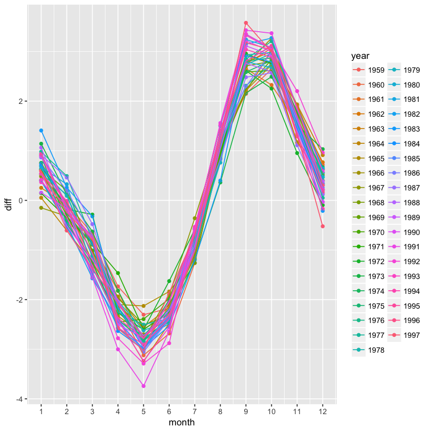

## Exercises ch 37 combining tables 

>1. Install and load the __Lahman__ library. This database includes data related to Baseball teams. It includes summary statistics about how the players performed on offense and defense for several years. It also includes personal information about the players.
>
>    The `Batting` data frame contains the offensive statistics for all players for many years. You can see, for example, the top 10 hitters by running this code:
>    
>    ```r
>    library(Lahman)
>    
>    top <- Batting %>% 
>      filter(yearID == 2016) %>%
>      arrange(desc(HR)) %>%
>      slice(1:10)
>    
>    top %>% tbl_df
>    ```
>
>    But who are these players? We see an ID, but not the names. The player names are in this table>
>
>    ```r
>    Master %>% as_tibble()
>    ```
>
>    We can see column names `nameFirst` and `nameLast`. Use the `left_join` function to create a table of the top home run hitters. The table should have `playerID`, first name, last name, and number of home runs (HR).  Rewrite the object `top` with this new table.    


```R
library(tidyverse)
```

    ── Attaching packages ─────────────────────────────────────── tidyverse 1.2.1 ──
    ✔ ggplot2 2.2.1     ✔ purrr   0.2.5
    ✔ tibble  1.4.2     ✔ dplyr   0.7.6
    ✔ tidyr   0.8.1     ✔ stringr 1.3.1
    ✔ readr   1.1.1     ✔ forcats 0.3.0
    ── Conflicts ────────────────────────────────────────── tidyverse_conflicts() ──
    ✖ dplyr::filter() masks stats::filter()
    ✖ dplyr::lag()    masks stats::lag()


```R
#install.packages("Lahman")
```


```R
library(Lahman)
```


```R
str(Batting)
```

    'data.frame':	102816 obs. of  22 variables:
     $ playerID: chr  "abercda01" "addybo01" "allisar01" "allisdo01" ...
     $ yearID  : int  1871 1871 1871 1871 1871 1871 1871 1871 1871 1871 ...
     $ stint   : int  1 1 1 1 1 1 1 1 1 1 ...
     $ teamID  : Factor w/ 149 levels "ALT","ANA","ARI",..: 136 111 39 142 111 56 111 24 56 24 ...
     $ lgID    : Factor w/ 7 levels "AA","AL","FL",..: 4 4 4 4 4 4 4 4 4 4 ...
     $ G       : int  1 25 29 27 25 12 1 31 1 18 ...
     $ AB      : int  4 118 137 133 120 49 4 157 5 86 ...
     $ R       : int  0 30 28 28 29 9 0 66 1 13 ...
     $ H       : int  0 32 40 44 39 11 1 63 1 13 ...
     $ X2B     : int  0 6 4 10 11 2 0 10 1 2 ...
     $ X3B     : int  0 0 5 2 3 1 0 9 0 1 ...
     $ HR      : int  0 0 0 2 0 0 0 0 0 0 ...
     $ RBI     : int  0 13 19 27 16 5 2 34 1 11 ...
     $ SB      : int  0 8 3 1 6 0 0 11 0 1 ...
     $ CS      : int  0 1 1 1 2 1 0 6 0 0 ...
     $ BB      : int  0 4 2 0 2 0 1 13 0 0 ...
     $ SO      : int  0 0 5 2 1 1 0 1 0 0 ...
     $ IBB     : int  NA NA NA NA NA NA NA NA NA NA ...
     $ HBP     : int  NA NA NA NA NA NA NA NA NA NA ...
     $ SH      : int  NA NA NA NA NA NA NA NA NA NA ...
     $ SF      : int  NA NA NA NA NA NA NA NA NA NA ...
     $ GIDP    : int  NA NA NA NA NA NA NA NA NA NA ...


```R
top <- Batting %>% filter(yearID == 2016) %>% arrange(desc(HR)) %>% slice(1:10)
```


```R
top %>% as_tibble()
```


<table>
<thead><tr><th scope=col>playerID</th><th scope=col>yearID</th><th scope=col>stint</th><th scope=col>teamID</th><th scope=col>lgID</th><th scope=col>G</th><th scope=col>AB</th><th scope=col>R</th><th scope=col>H</th><th scope=col>X2B</th><th scope=col>⋯</th><th scope=col>RBI</th><th scope=col>SB</th><th scope=col>CS</th><th scope=col>BB</th><th scope=col>SO</th><th scope=col>IBB</th><th scope=col>HBP</th><th scope=col>SH</th><th scope=col>SF</th><th scope=col>GIDP</th></tr></thead>
<tbody>
	<tr><td>trumbma01</td><td>2016     </td><td>1        </td><td>BAL      </td><td>AL       </td><td>159      </td><td>613      </td><td> 94      </td><td>157      </td><td>27       </td><td>⋯        </td><td>108      </td><td> 2       </td><td>0        </td><td>51       </td><td>170      </td><td> 1       </td><td> 3       </td><td>0        </td><td> 0       </td><td>14       </td></tr>
	<tr><td>cruzne02 </td><td>2016     </td><td>1        </td><td>SEA      </td><td>AL       </td><td>155      </td><td>589      </td><td> 96      </td><td>169      </td><td>27       </td><td>⋯        </td><td>105      </td><td> 2       </td><td>0        </td><td>62       </td><td>159      </td><td> 5       </td><td> 9       </td><td>0        </td><td> 7       </td><td>15       </td></tr>
	<tr><td>daviskh01</td><td>2016     </td><td>1        </td><td>OAK      </td><td>AL       </td><td>150      </td><td>555      </td><td> 85      </td><td>137      </td><td>24       </td><td>⋯        </td><td>102      </td><td> 1       </td><td>2        </td><td>42       </td><td>166      </td><td> 0       </td><td> 8       </td><td>0        </td><td> 5       </td><td>19       </td></tr>
	<tr><td>doziebr01</td><td>2016     </td><td>1        </td><td>MIN      </td><td>AL       </td><td>155      </td><td>615      </td><td>104      </td><td>165      </td><td>35       </td><td>⋯        </td><td> 99      </td><td>18       </td><td>2        </td><td>61       </td><td>138      </td><td> 6       </td><td> 8       </td><td>2        </td><td> 5       </td><td>12       </td></tr>
	<tr><td>encared01</td><td>2016     </td><td>1        </td><td>TOR      </td><td>AL       </td><td>160      </td><td>601      </td><td> 99      </td><td>158      </td><td>34       </td><td>⋯        </td><td>127      </td><td> 2       </td><td>0        </td><td>87       </td><td>138      </td><td> 3       </td><td> 5       </td><td>0        </td><td> 8       </td><td>22       </td></tr>
	<tr><td>arenano01</td><td>2016     </td><td>1        </td><td>COL      </td><td>NL       </td><td>160      </td><td>618      </td><td>116      </td><td>182      </td><td>35       </td><td>⋯        </td><td>133      </td><td> 2       </td><td>3        </td><td>68       </td><td>103      </td><td>10       </td><td> 2       </td><td>0        </td><td> 8       </td><td>17       </td></tr>
	<tr><td>cartech02</td><td>2016     </td><td>1        </td><td>MIL      </td><td>NL       </td><td>160      </td><td>549      </td><td> 84      </td><td>122      </td><td>27       </td><td>⋯        </td><td> 94      </td><td> 3       </td><td>1        </td><td>76       </td><td>206      </td><td> 1       </td><td> 9       </td><td>0        </td><td>10       </td><td>18       </td></tr>
	<tr><td>frazito01</td><td>2016     </td><td>1        </td><td>CHA      </td><td>AL       </td><td>158      </td><td>590      </td><td> 89      </td><td>133      </td><td>21       </td><td>⋯        </td><td> 98      </td><td>15       </td><td>5        </td><td>64       </td><td>163      </td><td> 1       </td><td> 4       </td><td>1        </td><td> 7       </td><td>11       </td></tr>
	<tr><td>bryankr01</td><td>2016     </td><td>1        </td><td>CHN      </td><td>NL       </td><td>155      </td><td>603      </td><td>121      </td><td>176      </td><td>35       </td><td>⋯        </td><td>102      </td><td> 8       </td><td>5        </td><td>75       </td><td>154      </td><td> 5       </td><td>18       </td><td>0        </td><td> 3       </td><td> 3       </td></tr>
	<tr><td>canoro01 </td><td>2016     </td><td>1        </td><td>SEA      </td><td>AL       </td><td>161      </td><td>655      </td><td>107      </td><td>195      </td><td>33       </td><td>⋯        </td><td>103      </td><td> 0       </td><td>1        </td><td>47       </td><td>100      </td><td> 8       </td><td> 8       </td><td>0        </td><td> 5       </td><td>18       </td></tr>
</tbody>
</table>


```R
str(Master)
```

    'data.frame':	19105 obs. of  26 variables:
     $ playerID    : chr  "aardsda01" "aaronha01" "aaronto01" "aasedo01" ...
     $ birthYear   : int  1981 1934 1939 1954 1972 1985 1850 1877 1869 1866 ...
     $ birthMonth  : int  12 2 8 9 8 12 11 4 11 10 ...
     $ birthDay    : int  27 5 5 8 25 17 4 15 11 14 ...
     $ birthCountry: chr  "USA" "USA" "USA" "USA" ...
     $ birthState  : chr  "CO" "AL" "AL" "CA" ...
     $ birthCity   : chr  "Denver" "Mobile" "Mobile" "Orange" ...
     $ deathYear   : int  NA NA 1984 NA NA NA 1905 1957 1962 1926 ...
     $ deathMonth  : int  NA NA 8 NA NA NA 5 1 6 4 ...
     $ deathDay    : int  NA NA 16 NA NA NA 17 6 11 27 ...
     $ deathCountry: chr  NA NA "USA" NA ...
     $ deathState  : chr  NA NA "GA" NA ...
     $ deathCity   : chr  NA NA "Atlanta" NA ...
     $ nameFirst   : chr  "David" "Hank" "Tommie" "Don" ...
     $ nameLast    : chr  "Aardsma" "Aaron" "Aaron" "Aase" ...
     $ nameGiven   : chr  "David Allan" "Henry Louis" "Tommie Lee" "Donald William" ...
     $ weight      : int  215 180 190 190 184 220 192 170 175 169 ...
     $ height      : int  75 72 75 75 73 73 72 71 71 68 ...
     $ bats        : Factor w/ 3 levels "B","L","R": 3 3 3 3 2 2 3 3 3 2 ...
     $ throws      : Factor w/ 3 levels "L","R","S": 2 2 2 2 1 1 2 2 2 1 ...
     $ debut       : chr  "2004-04-06" "1954-04-13" "1962-04-10" "1977-07-26" ...
     $ finalGame   : chr  "2015-08-23" "1976-10-03" "1971-09-26" "1990-10-03" ...
     $ retroID     : chr  "aardd001" "aaroh101" "aarot101" "aased001" ...
     $ bbrefID     : chr  "aardsda01" "aaronha01" "aaronto01" "aasedo01" ...
     $ deathDate   : Date, format: NA NA ...
     $ birthDate   : Date, format: "1981-12-27" "1934-02-05" ...


```R
Master %>% as.tibble()
```


<table>
<thead><tr><th scope=col>playerID</th><th scope=col>birthYear</th><th scope=col>birthMonth</th><th scope=col>birthDay</th><th scope=col>birthCountry</th><th scope=col>birthState</th><th scope=col>birthCity</th><th scope=col>deathYear</th><th scope=col>deathMonth</th><th scope=col>deathDay</th><th scope=col>⋯</th><th scope=col>weight</th><th scope=col>height</th><th scope=col>bats</th><th scope=col>throws</th><th scope=col>debut</th><th scope=col>finalGame</th><th scope=col>retroID</th><th scope=col>bbrefID</th><th scope=col>deathDate</th><th scope=col>birthDate</th></tr></thead>
<tbody>
	<tr><td>aardsda01   </td><td>1981        </td><td>12          </td><td>27          </td><td>USA         </td><td>CO          </td><td>Denver      </td><td>  NA        </td><td>NA          </td><td>NA          </td><td>⋯           </td><td>215         </td><td>75          </td><td>R           </td><td>R           </td><td>2004-04-06  </td><td>2015-08-23  </td><td>aardd001    </td><td>aardsda01   </td><td>NA          </td><td>1981-12-27  </td></tr>
	<tr><td>aaronha01   </td><td>1934        </td><td> 2          </td><td> 5          </td><td>USA         </td><td>AL          </td><td>Mobile      </td><td>  NA        </td><td>NA          </td><td>NA          </td><td>⋯           </td><td>180         </td><td>72          </td><td>R           </td><td>R           </td><td>1954-04-13  </td><td>1976-10-03  </td><td>aaroh101    </td><td>aaronha01   </td><td>NA          </td><td>1934-02-05  </td></tr>
	<tr><td>aaronto01   </td><td>1939        </td><td> 8          </td><td> 5          </td><td>USA         </td><td>AL          </td><td>Mobile      </td><td>1984        </td><td> 8          </td><td>16          </td><td>⋯           </td><td>190         </td><td>75          </td><td>R           </td><td>R           </td><td>1962-04-10  </td><td>1971-09-26  </td><td>aarot101    </td><td>aaronto01   </td><td>1984-08-16  </td><td>1939-08-05  </td></tr>
	<tr><td>aasedo01    </td><td>1954        </td><td> 9          </td><td> 8          </td><td>USA         </td><td>CA          </td><td>Orange      </td><td>  NA        </td><td>NA          </td><td>NA          </td><td>⋯           </td><td>190         </td><td>75          </td><td>R           </td><td>R           </td><td>1977-07-26  </td><td>1990-10-03  </td><td>aased001    </td><td>aasedo01    </td><td>NA          </td><td>1954-09-08  </td></tr>
	<tr><td>abadan01    </td><td>1972        </td><td> 8          </td><td>25          </td><td>USA         </td><td>FL          </td><td>Palm Beach  </td><td>  NA        </td><td>NA          </td><td>NA          </td><td>⋯           </td><td>184         </td><td>73          </td><td>L           </td><td>L           </td><td>2001-09-10  </td><td>2006-04-13  </td><td>abada001    </td><td>abadan01    </td><td>NA          </td><td>1972-08-25  </td></tr>
	<tr><td>abadfe01    </td><td>1985        </td><td>12          </td><td>17          </td><td>D.R.        </td><td>La Romana   </td><td>La Romana   </td><td>  NA        </td><td>NA          </td><td>NA          </td><td>⋯           </td><td>220         </td><td>73          </td><td>L           </td><td>L           </td><td>2010-07-28  </td><td>2016-09-25  </td><td>abadf001    </td><td>abadfe01    </td><td>NA          </td><td>1985-12-17  </td></tr>
	<tr><td>abadijo01   </td><td>1850        </td><td>11          </td><td> 4          </td><td>USA         </td><td>PA          </td><td>Philadelphia</td><td>1905        </td><td> 5          </td><td>17          </td><td>⋯           </td><td>192         </td><td>72          </td><td>R           </td><td>R           </td><td>1875-04-26  </td><td>1875-06-10  </td><td>abadj101    </td><td>abadijo01   </td><td>1905-05-17  </td><td>1850-11-04  </td></tr>
	<tr><td>abbated01   </td><td>1877        </td><td> 4          </td><td>15          </td><td>USA         </td><td>PA          </td><td>Latrobe     </td><td>1957        </td><td> 1          </td><td> 6          </td><td>⋯           </td><td>170         </td><td>71          </td><td>R           </td><td>R           </td><td>1897-09-04  </td><td>1910-09-15  </td><td>abbae101    </td><td>abbated01   </td><td>1957-01-06  </td><td>1877-04-15  </td></tr>
	<tr><td>abbeybe01   </td><td>1869        </td><td>11          </td><td>11          </td><td>USA         </td><td>VT          </td><td>Essex       </td><td>1962        </td><td> 6          </td><td>11          </td><td>⋯           </td><td>175         </td><td>71          </td><td>R           </td><td>R           </td><td>1892-06-14  </td><td>1896-09-23  </td><td>abbeb101    </td><td>abbeybe01   </td><td>1962-06-11  </td><td>1869-11-11  </td></tr>
	<tr><td>abbeych01   </td><td>1866        </td><td>10          </td><td>14          </td><td>USA         </td><td>NE          </td><td>Falls City  </td><td>1926        </td><td> 4          </td><td>27          </td><td>⋯           </td><td>169         </td><td>68          </td><td>L           </td><td>L           </td><td>1893-08-16  </td><td>1897-08-19  </td><td>abbec101    </td><td>abbeych01   </td><td>1926-04-27  </td><td>1866-10-14  </td></tr>
	<tr><td>abbotda01   </td><td>1862        </td><td> 3          </td><td>16          </td><td>USA         </td><td>OH          </td><td>Portage     </td><td>1930        </td><td> 2          </td><td>13          </td><td>⋯           </td><td>190         </td><td>71          </td><td>R           </td><td>R           </td><td>1890-04-19  </td><td>1890-05-23  </td><td>abbod101    </td><td>abbotda01   </td><td>1930-02-13  </td><td>1862-03-16  </td></tr>
	<tr><td>abbotfr01   </td><td>1874        </td><td>10          </td><td>22          </td><td>USA         </td><td>OH          </td><td>Versailles  </td><td>1935        </td><td> 6          </td><td>11          </td><td>⋯           </td><td>180         </td><td>70          </td><td>R           </td><td>R           </td><td>1903-04-25  </td><td>1905-09-20  </td><td>abbof101    </td><td>abbotfr01   </td><td>1935-06-11  </td><td>1874-10-22  </td></tr>
	<tr><td>abbotgl01   </td><td>1951        </td><td> 2          </td><td>16          </td><td>USA         </td><td>AR          </td><td>Little Rock </td><td>  NA        </td><td>NA          </td><td>NA          </td><td>⋯           </td><td>200         </td><td>78          </td><td>R           </td><td>R           </td><td>1973-07-29  </td><td>1984-08-08  </td><td>abbog001    </td><td>abbotgl01   </td><td>NA          </td><td>1951-02-16  </td></tr>
	<tr><td>abbotje01   </td><td>1972        </td><td> 8          </td><td>17          </td><td>USA         </td><td>GA          </td><td>Atlanta     </td><td>  NA        </td><td>NA          </td><td>NA          </td><td>⋯           </td><td>190         </td><td>74          </td><td>R           </td><td>L           </td><td>1997-06-10  </td><td>2001-09-29  </td><td>abboj002    </td><td>abbotje01   </td><td>NA          </td><td>1972-08-17  </td></tr>
	<tr><td>abbotji01   </td><td>1967        </td><td> 9          </td><td>19          </td><td>USA         </td><td>MI          </td><td>Flint       </td><td>  NA        </td><td>NA          </td><td>NA          </td><td>⋯           </td><td>200         </td><td>75          </td><td>L           </td><td>L           </td><td>1989-04-08  </td><td>1999-07-21  </td><td>abboj001    </td><td>abbotji01   </td><td>NA          </td><td>1967-09-19  </td></tr>
	<tr><td>abbotku01   </td><td>1969        </td><td> 6          </td><td> 2          </td><td>USA         </td><td>OH          </td><td>Zanesville  </td><td>  NA        </td><td>NA          </td><td>NA          </td><td>⋯           </td><td>180         </td><td>71          </td><td>R           </td><td>R           </td><td>1993-09-07  </td><td>2001-04-13  </td><td>abbok002    </td><td>abbotku01   </td><td>NA          </td><td>1969-06-02  </td></tr>
	<tr><td>abbotky01   </td><td>1968        </td><td> 2          </td><td>18          </td><td>USA         </td><td>MA          </td><td>Newburyport </td><td>  NA        </td><td>NA          </td><td>NA          </td><td>⋯           </td><td>200         </td><td>76          </td><td>L           </td><td>L           </td><td>1991-09-10  </td><td>1996-08-24  </td><td>abbok001    </td><td>abbotky01   </td><td>NA          </td><td>1968-02-18  </td></tr>
	<tr><td>abbotod01   </td><td>1888        </td><td> 9          </td><td> 5          </td><td>USA         </td><td>PA          </td><td>New Eagle   </td><td>1933        </td><td> 4          </td><td>13          </td><td>⋯           </td><td>180         </td><td>74          </td><td>R           </td><td>R           </td><td>1910-09-10  </td><td>1910-10-15  </td><td>abboo101    </td><td>abbotod01   </td><td>1933-04-13  </td><td>1888-09-05  </td></tr>
	<tr><td>abbotpa01   </td><td>1967        </td><td> 9          </td><td>15          </td><td>USA         </td><td>CA          </td><td>Van Nuys    </td><td>  NA        </td><td>NA          </td><td>NA          </td><td>⋯           </td><td>185         </td><td>75          </td><td>R           </td><td>R           </td><td>1990-08-21  </td><td>2004-08-07  </td><td>abbop001    </td><td>abbotpa01   </td><td>NA          </td><td>1967-09-15  </td></tr>
	<tr><td>aberal01    </td><td>1927        </td><td> 7          </td><td>31          </td><td>USA         </td><td>OH          </td><td>Cleveland   </td><td>1993        </td><td> 5          </td><td>20          </td><td>⋯           </td><td>195         </td><td>74          </td><td>L           </td><td>L           </td><td>1950-09-15  </td><td>1957-09-11  </td><td>abera101    </td><td>aberal01    </td><td>1993-05-20  </td><td>1927-07-31  </td></tr>
	<tr><td>abercda01   </td><td>1850        </td><td> 1          </td><td> 2          </td><td>USA         </td><td>OK          </td><td>Fort Towson </td><td>1939        </td><td>11          </td><td>11          </td><td>⋯           </td><td> NA         </td><td>NA          </td><td>NA          </td><td>NA          </td><td>1871-10-21  </td><td>1871-10-21  </td><td>aberd101    </td><td>abercda01   </td><td>1939-11-11  </td><td>1850-01-02  </td></tr>
	<tr><td>abercre01   </td><td>1980        </td><td> 7          </td><td>15          </td><td>USA         </td><td>GA          </td><td>Columbus    </td><td>  NA        </td><td>NA          </td><td>NA          </td><td>⋯           </td><td>215         </td><td>75          </td><td>R           </td><td>R           </td><td>2006-04-04  </td><td>2008-09-28  </td><td>aberr001    </td><td>abercre01   </td><td>NA          </td><td>1980-07-15  </td></tr>
	<tr><td>abernbi01   </td><td>1929        </td><td> 1          </td><td>30          </td><td>USA         </td><td>CA          </td><td>Torrance    </td><td>2006        </td><td> 2          </td><td>19          </td><td>⋯           </td><td>190         </td><td>70          </td><td>R           </td><td>R           </td><td>1952-09-27  </td><td>1952-09-27  </td><td>aberb101    </td><td>abernbi01   </td><td>2006-02-19  </td><td>1929-01-30  </td></tr>
	<tr><td>abernbr01   </td><td>1977        </td><td> 9          </td><td>23          </td><td>USA         </td><td>GA          </td><td>Atlanta     </td><td>  NA        </td><td>NA          </td><td>NA          </td><td>⋯           </td><td>185         </td><td>73          </td><td>R           </td><td>R           </td><td>2001-06-25  </td><td>2005-09-29  </td><td>aberb001    </td><td>abernbr01   </td><td>NA          </td><td>1977-09-23  </td></tr>
	<tr><td>abernte01   </td><td>1921        </td><td>10          </td><td>30          </td><td>USA         </td><td>NC          </td><td>Bynum       </td><td>2001        </td><td>11          </td><td>16          </td><td>⋯           </td><td>210         </td><td>74          </td><td>R           </td><td>L           </td><td>1942-09-19  </td><td>1944-04-29  </td><td>abert102    </td><td>abernte01   </td><td>2001-11-16  </td><td>1921-10-30  </td></tr>
	<tr><td>abernte02   </td><td>1933        </td><td> 3          </td><td> 6          </td><td>USA         </td><td>NC          </td><td>Stanley     </td><td>2004        </td><td>12          </td><td>16          </td><td>⋯           </td><td>215         </td><td>76          </td><td>R           </td><td>R           </td><td>1955-04-13  </td><td>1972-09-30  </td><td>abert101    </td><td>abernte02   </td><td>2004-12-16  </td><td>1933-03-06  </td></tr>
	<tr><td>abernwo01   </td><td>1915        </td><td> 2          </td><td> 1          </td><td>USA         </td><td>NC          </td><td>Forest City </td><td>1994        </td><td>12          </td><td> 5          </td><td>⋯           </td><td>170         </td><td>72          </td><td>L           </td><td>L           </td><td>1946-07-28  </td><td>1947-04-17  </td><td>aberw101    </td><td>abernwo01   </td><td>1994-12-05  </td><td>1915-02-01  </td></tr>
	<tr><td>aberscl01   </td><td>1921        </td><td> 8          </td><td>28          </td><td>USA         </td><td>IL          </td><td>Chicago     </td><td>1973        </td><td> 6          </td><td>23          </td><td>⋯           </td><td>200         </td><td>72          </td><td>R           </td><td>R           </td><td>1947-07-18  </td><td>1949-05-09  </td><td>aberc101    </td><td>aberscl01   </td><td>1973-06-23  </td><td>1921-08-28  </td></tr>
	<tr><td>ablesha01   </td><td>1883        </td><td>10          </td><td> 4          </td><td>USA         </td><td>TX          </td><td>Terrell     </td><td>1951        </td><td> 2          </td><td> 8          </td><td>⋯           </td><td>200         </td><td>74          </td><td>R           </td><td>L           </td><td>1905-09-04  </td><td>1911-05-05  </td><td>ableh101    </td><td>ablesha01   </td><td>1951-02-08  </td><td>1883-10-04  </td></tr>
	<tr><td>abnersh01   </td><td>1966        </td><td> 6          </td><td>17          </td><td>USA         </td><td>OH          </td><td>Hamilton    </td><td>  NA        </td><td>NA          </td><td>NA          </td><td>⋯           </td><td>190         </td><td>73          </td><td>R           </td><td>R           </td><td>1987-09-08  </td><td>1992-10-03  </td><td>abnes001    </td><td>abnersh01   </td><td>NA          </td><td>1966-06-17  </td></tr>
	<tr><td>⋮</td><td>⋮</td><td>⋮</td><td>⋮</td><td>⋮</td><td>⋮</td><td>⋮</td><td>⋮</td><td>⋮</td><td>⋮</td><td>⋱</td><td>⋮</td><td>⋮</td><td>⋮</td><td>⋮</td><td>⋮</td><td>⋮</td><td>⋮</td><td>⋮</td><td>⋮</td><td>⋮</td></tr>
	<tr><td>zimmejo02       </td><td>1986            </td><td> 5              </td><td>23              </td><td>USA             </td><td>WI              </td><td>Auburndale      </td><td>  NA            </td><td>NA              </td><td>NA              </td><td>⋯               </td><td>225             </td><td>74              </td><td>R               </td><td>R               </td><td>2009-04-20      </td><td>2016-10-01      </td><td>zimmj003        </td><td>zimmejo02       </td><td>NA              </td><td>1986-05-23      </td></tr>
	<tr><td>zimmero01       </td><td>1913            </td><td> 9              </td><td>13              </td><td>USA             </td><td>PA              </td><td>Pine Grove      </td><td>1991            </td><td>11              </td><td>22              </td><td>⋯               </td><td>187             </td><td>74              </td><td>L               </td><td>L               </td><td>1945-08-27      </td><td>1945-09-30      </td><td>zimmr101        </td><td>zimmero01       </td><td>1991-11-22      </td><td>1913-09-13      </td></tr>
	<tr><td>zimmery01       </td><td>1984            </td><td> 9              </td><td>28              </td><td>USA             </td><td>NC              </td><td>Washington      </td><td>  NA            </td><td>NA              </td><td>NA              </td><td>⋯               </td><td>225             </td><td>75              </td><td>R               </td><td>R               </td><td>2005-09-01      </td><td>2016-10-02      </td><td>zimmr001        </td><td>zimmery01       </td><td>NA              </td><td>1984-09-28      </td></tr>
	<tr><td>zinkch01        </td><td>1979            </td><td> 8              </td><td>26              </td><td>USA             </td><td>CA              </td><td>Carmichael      </td><td>  NA            </td><td>NA              </td><td>NA              </td><td>⋯               </td><td>190             </td><td>73              </td><td>R               </td><td>R               </td><td>2008-08-12      </td><td>2008-08-12      </td><td>zinkc001        </td><td>zinkch01        </td><td>NA              </td><td>1979-08-26      </td></tr>
	<tr><td>zinkwa01        </td><td>1898            </td><td>11              </td><td>21              </td><td>USA             </td><td>MA              </td><td>Pittsfield      </td><td>1964            </td><td> 6              </td><td>12              </td><td>⋯               </td><td>165             </td><td>72              </td><td>R               </td><td>R               </td><td>1921-07-06      </td><td>1921-07-19      </td><td>zinkw101        </td><td>zinkwa01        </td><td>1964-06-12      </td><td>1898-11-21      </td></tr>
	<tr><td>zinnfr01        </td><td>1865            </td><td>12              </td><td>21              </td><td>USA             </td><td>PA              </td><td>Phoenixville    </td><td>1936            </td><td> 5              </td><td>12              </td><td>⋯               </td><td>150             </td><td>68              </td><td>NA              </td><td>NA              </td><td>1888-04-18      </td><td>1888-05-03      </td><td>zinnf101        </td><td>zinnfr01        </td><td>1936-05-12      </td><td>1865-12-21      </td></tr>
	<tr><td>zinngu01        </td><td>1887            </td><td> 2              </td><td>13              </td><td>USA             </td><td>WV              </td><td>Holbrook        </td><td>1949            </td><td>10              </td><td> 6              </td><td>⋯               </td><td>170             </td><td>70              </td><td>L               </td><td>R               </td><td>1911-09-11      </td><td>1915-09-16      </td><td>zinng101        </td><td>zinngu01        </td><td>1949-10-06      </td><td>1887-02-13      </td></tr>
	<tr><td>zinnji01        </td><td>1895            </td><td> 1              </td><td>21              </td><td>USA             </td><td>AR              </td><td>Benton          </td><td>1991            </td><td> 2              </td><td>26              </td><td>⋯               </td><td>195             </td><td>72              </td><td>L               </td><td>R               </td><td>1919-09-04      </td><td>1929-08-25      </td><td>zinnj101        </td><td>zinnji01        </td><td>1991-02-26      </td><td>1895-01-21      </td></tr>
	<tr><td>zinsebi01       </td><td>1918            </td><td> 1              </td><td> 6              </td><td>USA             </td><td>NY              </td><td>Astoria         </td><td>1993            </td><td> 2              </td><td>16              </td><td>⋯               </td><td>185             </td><td>73              </td><td>R               </td><td>R               </td><td>1944-08-19      </td><td>1944-08-26      </td><td>zinsb101        </td><td>zinsebi01       </td><td>1993-02-16      </td><td>1918-01-06      </td></tr>
	<tr><td>zinteal01       </td><td>1968            </td><td> 5              </td><td>19              </td><td>USA             </td><td>TX              </td><td>El Paso         </td><td>  NA            </td><td>NA              </td><td>NA              </td><td>⋯               </td><td>200             </td><td>74              </td><td>B               </td><td>R               </td><td>2002-06-18      </td><td>2004-10-03      </td><td>zinta001        </td><td>zinteal01       </td><td>NA              </td><td>1968-05-19      </td></tr>
	<tr><td>zipfebu01       </td><td>1938            </td><td>11              </td><td>18              </td><td>USA             </td><td>IL              </td><td>Belleville      </td><td>  NA            </td><td>NA              </td><td>NA              </td><td>⋯               </td><td>200             </td><td>75              </td><td>L               </td><td>R               </td><td>1961-07-26      </td><td>1962-09-30      </td><td>zipfb101        </td><td>zipfebu01       </td><td>NA              </td><td>1938-11-18      </td></tr>
	<tr><td>ziskri01        </td><td>1949            </td><td> 2              </td><td> 6              </td><td>USA             </td><td>NY              </td><td>Brooklyn        </td><td>  NA            </td><td>NA              </td><td>NA              </td><td>⋯               </td><td>200             </td><td>73              </td><td>R               </td><td>R               </td><td>1971-09-08      </td><td>1983-09-21      </td><td>ziskr101        </td><td>ziskri01        </td><td>NA              </td><td>1949-02-06      </td></tr>
	<tr><td>zitoba01        </td><td>1978            </td><td> 5              </td><td>13              </td><td>USA             </td><td>NV              </td><td>Las Vegas       </td><td>  NA            </td><td>NA              </td><td>NA              </td><td>⋯               </td><td>205             </td><td>74              </td><td>L               </td><td>L               </td><td>2000-07-22      </td><td>2015-09-30      </td><td>zitob001        </td><td>zitoba01        </td><td>NA              </td><td>1978-05-13      </td></tr>
	<tr><td>zitzmbi01       </td><td>1895            </td><td>11              </td><td>19              </td><td>USA             </td><td>NY              </td><td>Long Island City</td><td>1985            </td><td> 5              </td><td>29              </td><td>⋯               </td><td>175             </td><td>70              </td><td>R               </td><td>R               </td><td>1919-04-27      </td><td>1929-09-25      </td><td>zitzb101        </td><td>zitzmbi01       </td><td>1985-05-29      </td><td>1895-11-19      </td></tr>
	<tr><td>zmiched01       </td><td>1884            </td><td>10              </td><td> 1              </td><td>USA             </td><td>OH              </td><td>Cleveland       </td><td>1950            </td><td> 8              </td><td>20              </td><td>⋯               </td><td>180             </td><td>72              </td><td>L               </td><td>L               </td><td>1910-07-23      </td><td>1911-06-01      </td><td>zmice101        </td><td>zmiched01       </td><td>1950-08-20      </td><td>1884-10-01      </td></tr>
	<tr><td>zobribe01       </td><td>1981            </td><td> 5              </td><td>26              </td><td>USA             </td><td>IL              </td><td>Eureka          </td><td>  NA            </td><td>NA              </td><td>NA              </td><td>⋯               </td><td>210             </td><td>75              </td><td>B               </td><td>R               </td><td>2006-08-01      </td><td>2016-10-02      </td><td>zobrb001        </td><td>zobribe01       </td><td>NA              </td><td>1981-05-26      </td></tr>
	<tr><td>zoccope01       </td><td>1977            </td><td> 2              </td><td> 6              </td><td>USA             </td><td>NY              </td><td>Bronx           </td><td>  NA            </td><td>NA              </td><td>NA              </td><td>⋯               </td><td>200             </td><td>74              </td><td>L               </td><td>R               </td><td>2003-09-05      </td><td>2003-09-28      </td><td>zoccp001        </td><td>zoccope01       </td><td>NA              </td><td>1977-02-06      </td></tr>
	<tr><td>zoldasa01       </td><td>1918            </td><td>12              </td><td> 8              </td><td>USA             </td><td>NY              </td><td>Brooklyn        </td><td>1966            </td><td> 8              </td><td>25              </td><td>⋯               </td><td>185             </td><td>71              </td><td>L               </td><td>L               </td><td>1944-05-13      </td><td>1952-08-26      </td><td>zolds101        </td><td>zoldasa01       </td><td>1966-08-25      </td><td>1918-12-08      </td></tr>
	<tr><td>zoskyed01       </td><td>1968            </td><td> 2              </td><td>10              </td><td>USA             </td><td>CA              </td><td>Whittier        </td><td>  NA            </td><td>NA              </td><td>NA              </td><td>⋯               </td><td>175             </td><td>72              </td><td>R               </td><td>R               </td><td>1991-09-02      </td><td>2000-10-01      </td><td>zoske001        </td><td>zoskyed01       </td><td>NA              </td><td>1968-02-10      </td></tr>
	<tr><td>zuberbi01       </td><td>1913            </td><td> 3              </td><td>26              </td><td>USA             </td><td>IA              </td><td>Middle Amana    </td><td>1982            </td><td>11              </td><td> 2              </td><td>⋯               </td><td>195             </td><td>74              </td><td>R               </td><td>R               </td><td>1936-09-16      </td><td>1947-09-23      </td><td>zubeb101        </td><td>zuberbi01       </td><td>1982-11-02      </td><td>1913-03-26      </td></tr>
	<tr><td>zuberjo01       </td><td>1969            </td><td>12              </td><td>10              </td><td>USA             </td><td>CA              </td><td>Encino          </td><td>  NA            </td><td>NA              </td><td>NA              </td><td>⋯               </td><td>190             </td><td>73              </td><td>L               </td><td>L               </td><td>1996-04-19      </td><td>1998-09-27      </td><td>zubej001        </td><td>zuberjo01       </td><td>NA              </td><td>1969-12-10      </td></tr>
	<tr><td>zuletju01       </td><td>1975            </td><td> 3              </td><td>28              </td><td>Panama          </td><td>Panama          </td><td>Panama          </td><td>  NA            </td><td>NA              </td><td>NA              </td><td>⋯               </td><td>230             </td><td>78              </td><td>R               </td><td>R               </td><td>2000-04-06      </td><td>2001-06-25      </td><td>zulej001        </td><td>zuletju01       </td><td>NA              </td><td>1975-03-28      </td></tr>
	<tr><td>zumayjo01       </td><td>1984            </td><td>11              </td><td> 9              </td><td>USA             </td><td>CA              </td><td>Chula Vista     </td><td>  NA            </td><td>NA              </td><td>NA              </td><td>⋯               </td><td>215             </td><td>75              </td><td>R               </td><td>R               </td><td>2006-04-03      </td><td>2010-06-28      </td><td>zumaj001        </td><td>zumayjo01       </td><td>NA              </td><td>1984-11-09      </td></tr>
	<tr><td>zuninmi01       </td><td>1991            </td><td> 3              </td><td>25              </td><td>USA             </td><td>FL              </td><td>Cape Coral      </td><td>  NA            </td><td>NA              </td><td>NA              </td><td>⋯               </td><td>220             </td><td>74              </td><td>R               </td><td>R               </td><td>2013-06-12      </td><td>2016-10-02      </td><td>zunim001        </td><td>zuninmi01       </td><td>NA              </td><td>1991-03-25      </td></tr>
	<tr><td>zupcibo01       </td><td>1966            </td><td> 8              </td><td>18              </td><td>USA             </td><td>PA              </td><td>Pittsburgh      </td><td>  NA            </td><td>NA              </td><td>NA              </td><td>⋯               </td><td>220             </td><td>76              </td><td>R               </td><td>R               </td><td>1991-09-07      </td><td>1994-08-04      </td><td>zupcb001        </td><td>zupcibo01       </td><td>NA              </td><td>1966-08-18      </td></tr>
	<tr><td>zupofr01        </td><td>1939            </td><td> 8              </td><td>29              </td><td>USA             </td><td>CA              </td><td>San Francisco   </td><td>2005            </td><td> 3              </td><td>25              </td><td>⋯               </td><td>182             </td><td>71              </td><td>L               </td><td>R               </td><td>1957-07-01      </td><td>1961-05-09      </td><td>zupof101        </td><td>zupofr01        </td><td>2005-03-25      </td><td>1939-08-29      </td></tr>
	<tr><td>zuvelpa01       </td><td>1958            </td><td>10              </td><td>31              </td><td>USA             </td><td>CA              </td><td>San Mateo       </td><td>  NA            </td><td>NA              </td><td>NA              </td><td>⋯               </td><td>173             </td><td>72              </td><td>R               </td><td>R               </td><td>1982-09-04      </td><td>1991-05-02      </td><td>zuvep001        </td><td>zuvelpa01       </td><td>NA              </td><td>1958-10-31      </td></tr>
	<tr><td>zuverge01       </td><td>1924            </td><td> 8              </td><td>20              </td><td>USA             </td><td>MI              </td><td>Holland         </td><td>2014            </td><td> 9              </td><td> 8              </td><td>⋯               </td><td>195             </td><td>76              </td><td>R               </td><td>R               </td><td>1951-04-21      </td><td>1959-06-15      </td><td>zuveg101        </td><td>zuverge01       </td><td>2014-09-08      </td><td>1924-08-20      </td></tr>
	<tr><td>zwilldu01       </td><td>1888            </td><td>11              </td><td> 2              </td><td>USA             </td><td>MO              </td><td>St. Louis       </td><td>1978            </td><td> 3              </td><td>27              </td><td>⋯               </td><td>160             </td><td>66              </td><td>L               </td><td>L               </td><td>1910-08-14      </td><td>1916-07-12      </td><td>zwild101        </td><td>zwilldu01       </td><td>1978-03-27      </td><td>1888-11-02      </td></tr>
	<tr><td>zychto01        </td><td>1990            </td><td> 8              </td><td> 7              </td><td>USA             </td><td>IL              </td><td>Monee           </td><td>  NA            </td><td>NA              </td><td>NA              </td><td>⋯               </td><td>190             </td><td>75              </td><td>R               </td><td>R               </td><td>2015-09-04      </td><td>2016-08-24      </td><td>zycht001        </td><td>zychto01        </td><td>NA              </td><td>1990-08-07      </td></tr>
</tbody>
</table>


```R
top_hr <- top %>% left_join(Master, by = "playerID") %>% select(playerID,yearID,nameFirst,nameLast,teamID,HR)
```


```R
top_hr
```


<table>
<thead><tr><th scope=col>playerID</th><th scope=col>yearID</th><th scope=col>nameFirst</th><th scope=col>nameLast</th><th scope=col>teamID</th><th scope=col>HR</th></tr></thead>
<tbody>
	<tr><td>trumbma01  </td><td>2016       </td><td>Mark       </td><td>Trumbo     </td><td>BAL        </td><td>47         </td></tr>
	<tr><td>cruzne02   </td><td>2016       </td><td>Nelson     </td><td>Cruz       </td><td>SEA        </td><td>43         </td></tr>
	<tr><td>daviskh01  </td><td>2016       </td><td>Khris      </td><td>Davis      </td><td>OAK        </td><td>42         </td></tr>
	<tr><td>doziebr01  </td><td>2016       </td><td>Brian      </td><td>Dozier     </td><td>MIN        </td><td>42         </td></tr>
	<tr><td>encared01  </td><td>2016       </td><td>Edwin      </td><td>Encarnacion</td><td>TOR        </td><td>42         </td></tr>
	<tr><td>arenano01  </td><td>2016       </td><td>Nolan      </td><td>Arenado    </td><td>COL        </td><td>41         </td></tr>
	<tr><td>cartech02  </td><td>2016       </td><td>Chris      </td><td>Carter     </td><td>MIL        </td><td>41         </td></tr>
	<tr><td>frazito01  </td><td>2016       </td><td>Todd       </td><td>Frazier    </td><td>CHA        </td><td>40         </td></tr>
	<tr><td>bryankr01  </td><td>2016       </td><td>Kris       </td><td>Bryant     </td><td>CHN        </td><td>39         </td></tr>
	<tr><td>canoro01   </td><td>2016       </td><td>Robinson   </td><td>Cano       </td><td>SEA        </td><td>39         </td></tr>
</tbody>
</table>


>2. Now use the `Salaries` data frame to add each player's salary to the table you created in exercise. Note that salaries are different every year so make sure to filter for the year 2016, then use `right_join`. This time show first name, last name, team, HR and salary.   


```R
top_hr_sal <- Salaries %>% filter(yearID==2016) %>% select(-lgID,-teamID,-yearID) %>% right_join(top_hr, by = "playerID") 
```


```R
top_hr_sal[c(1,4,5,6,2,7)]
```


<table>
<thead><tr><th scope=col>playerID</th><th scope=col>nameFirst</th><th scope=col>nameLast</th><th scope=col>teamID</th><th scope=col>salary</th><th scope=col>HR</th></tr></thead>
<tbody>
	<tr><td>trumbma01  </td><td>Mark       </td><td>Trumbo     </td><td>BAL        </td><td> 9150000   </td><td>47         </td></tr>
	<tr><td>cruzne02   </td><td>Nelson     </td><td>Cruz       </td><td>SEA        </td><td>14250000   </td><td>43         </td></tr>
	<tr><td>daviskh01  </td><td>Khris      </td><td>Davis      </td><td>OAK        </td><td>  524500   </td><td>42         </td></tr>
	<tr><td>doziebr01  </td><td>Brian      </td><td>Dozier     </td><td>MIN        </td><td> 3000000   </td><td>42         </td></tr>
	<tr><td>encared01  </td><td>Edwin      </td><td>Encarnacion</td><td>TOR        </td><td>10000000   </td><td>42         </td></tr>
	<tr><td>arenano01  </td><td>Nolan      </td><td>Arenado    </td><td>COL        </td><td> 5000000   </td><td>41         </td></tr>
	<tr><td>cartech02  </td><td>Chris      </td><td>Carter     </td><td>MIL        </td><td> 2500000   </td><td>41         </td></tr>
	<tr><td>frazito01  </td><td>Todd       </td><td>Frazier    </td><td>CHA        </td><td> 8250000   </td><td>40         </td></tr>
	<tr><td>bryankr01  </td><td>Kris       </td><td>Bryant     </td><td>CHN        </td><td>  652000   </td><td>39         </td></tr>
	<tr><td>canoro01   </td><td>Robinson   </td><td>Cano       </td><td>SEA        </td><td>24000000   </td><td>39         </td></tr>
</tbody>
</table>


>3. In a previous exercise, we created a tidy version of the `co2` dataset:
>
>
>    ```r
>    co2_wide <- data.frame(matrix(co2, ncol = 12, byrow = TRUE)) %>% 
>      setNames(1:12) %>%
>      mutate(year = 1959:1997) %>%
>      gather(month, co2, -year, convert = TRUE)
>    ```
>
>    We want to see if the monthly trend is changing so we are going to remove the year effects and the plot the data. We will first compute the year averages. Use the `group_by` and `summarize` to compute the average co2 for each year. Save in an object called `yearly_avg`.


```R
co2_wide <- as_tibble(matrix(co2,ncol=12,byrow=TRUE)) %>% setNames(1:12) %>% mutate(year=1959:1997) %>% gather(month,co2,-year, convert=TRUE)
```


```R
yearly_avg <- co2_wide %>% group_by(year) %>% summarize(mean(co2))
```

>4. Now use the `left_join` function to add the yearly average to the `co2_wide` dataset. Then compute the residuals: observed co2 measure - yearly average.


```R
co2_avg <- yearly_avg %>% left_join(co2_wide,by="year") %>% arrange(year) %>% setNames(c("year","mean","month","value"))
```


```R
co2_avg <- co2_avg  %>% mutate(diff = mean-value)
```

>5. Make a plot of the seasonal trends by year but only after removing the year effect.


```R
co2_plot <- co2_avg %>% mutate(year = as.factor(year))
```


```R
co2_plot %>% ggplot(aes(month,diff,color=year)) + geom_point() + geom_line() + scale_x_continuous(breaks=1:12)
```




