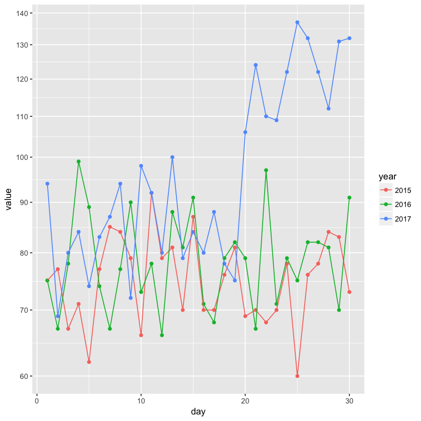

## Exercises


```R
library(tidyverse)
library(dslabs)
library(pdftools)
```

1. Complete all lessons and exercises in the [https://regexone.com/](https://regexone.com/) online interactive tutorial.
    Done.
2. In the `extdata` directory of the __dslabs__ package, you will find a PDF file containing daily mortality data for Puerto Rico from Jan 1, 2015 to May 31, 2018. You can find the file like this:

    `fn <- system.file("extdata", "RD-Mortality-Report_2015-18-180531.pdf",package="dslabs")`

    Find and open the file or open it directly from RStudio. On a Mac, you can type:

    `system2("open", args = fn)`

    and on Windows, you can type:
    
    `system("cmd.exe", input = paste("start", fn))`

    Which of the following best describes this file:

    A. It is a table. Extracting the data will be easy.
    
    B. It is a report written in prose.  Extracting the data will be impossible.
    
    __C__. It is a report combining graphs and tables. Extracting the data seems possible.
    
    D. It shows graphs of the data. Extracting the data will be difficult.
    Done.
    
3. We are going to create a tidy dataset with each row representing one observation. The variables in this dataset will be year, month, day and deaths. Start by installing and loading the __pdftools__ package:
    
    `install.packages("pdftools")`
    `library(pdftools)`
    
    Now read-in `fn` using the `pdf_text` function, store the results in an object called `txt`. Describe what you see in `txt`.

    A. A table with the mortality data.
    
    __B__. A character string of length 12. Each entry represents the text in each page. The mortality data is in there somewhere.
    
    C. A character string with one entry containing all the information in the PDF file.
    
    D. An html document.

    


```R
fn <- system.file("extdata", "RD-Mortality-Report_2015-18-180531.pdf",package="dslabs")
```


```R
txt <- pdf_text(fn)
```


```R
length(txt)
```


12


4. Extract the ninth page of the PDF file from the object `txt`, then use the `str_split` from the __stringr__ package so that you have each line in a different entry. Call this string vector `s`. Then look at the result and choose the one that best describes what you see.

    A. It is an empty string.
   
    B. I can see the figure shown in page 1.
   
    C. It is a tidy table.
   
    __D__. I can see the table! But there is a bunch of other stuff we need to get rid of.

    


```R
s <- txt[9] %>% str_split("\\n")
s
```


<ol>
	<li><ol class=list-inline>
	<li><span style=white-space:pre-wrap>'6/4/2018                               Departamento de Salud - Registro Demográfico - División de Calidad y Estadísticas Vitales'</span></li>
	<li><span style=white-space:pre-wrap>'SEP    2015  2016   2017  2018'</span></li>
	<li><span style=white-space:pre-wrap>'    1     75    75     94      0'</span></li>
	<li><span style=white-space:pre-wrap>'    2     77    67     69      0                                                                      Defunciones Ocurridas en Septiembre por Día y Año'</span></li>
	<li><span style=white-space:pre-wrap>'    3     67    78     80      0'</span></li>
	<li><span style=white-space:pre-wrap>'                                   140'</span></li>
	<li><span style=white-space:pre-wrap>'    4     71    99     84      0'</span></li>
	<li><span style=white-space:pre-wrap>'    5     62    89     74      0'</span></li>
	<li><span style=white-space:pre-wrap>'                                   120'</span></li>
	<li><span style=white-space:pre-wrap>'    6     77    74     83      0'</span></li>
	<li><span style=white-space:pre-wrap>'    7     85    67     87      0'</span></li>
	<li><span style=white-space:pre-wrap>'    8     84    77     94      0   100'</span></li>
	<li><span style=white-space:pre-wrap>'    9     79    90     72      0'</span></li>
	<li><span style=white-space:pre-wrap>'   10     66    73     98      0    80'</span></li>
	<li><span style=white-space:pre-wrap>'   11     92    78     92      0'</span></li>
	<li><span style=white-space:pre-wrap>'   12     79    66     80      0    60'</span></li>
	<li><span style=white-space:pre-wrap>'   13     81    88    100      0'</span></li>
	<li><span style=white-space:pre-wrap>'   14     70    81     79      0    40'</span></li>
	<li><span style=white-space:pre-wrap>'   15     87    91     84      0'</span></li>
	<li><span style=white-space:pre-wrap>'   16     70    71     80      0    20'</span></li>
	<li><span style=white-space:pre-wrap>'   17     70    68     88      0'</span></li>
	<li><span style=white-space:pre-wrap>'   18     76    79     78      0      0'</span></li>
	<li><span style=white-space:pre-wrap>'   19     81    82     75      0            1       2    3        4      5      6       7       8       9    10 11 12    13 14    15 16    17 18   19 20 21 22 23 24 25 26 27 28 29 30'</span></li>
	<li><span style=white-space:pre-wrap>'   20     69    79    106      0   Fuente: Registro Demográfico - División de Calidad y Estadísticas Vitales         2015      2016     2017     2018'</span></li>
	<li><span style=white-space:pre-wrap>'   21     70    67    124      0'</span></li>
	<li><span style=white-space:pre-wrap>'   22     68    97    110      0'</span></li>
	<li><span style=white-space:pre-wrap>'   23     70    71    109      0'</span></li>
	<li><span style=white-space:pre-wrap>'   24     78    79    122      0'</span></li>
	<li><span style=white-space:pre-wrap>'   25     60    75    137      0'</span></li>
	<li><span style=white-space:pre-wrap>'   26     76    82    132      0'</span></li>
	<li><span style=white-space:pre-wrap>'   27     78    82    122      0'</span></li>
	<li><span style=white-space:pre-wrap>'   28     84    81    112      0'</span></li>
	<li><span style=white-space:pre-wrap>'   29     83    70    131      0'</span></li>
	<li><span style=white-space:pre-wrap>'   30     73    91    132      0'</span></li>
	<li><span style=white-space:pre-wrap>'Total   2258  2367   2928      0'</span></li>
	<li><span style=white-space:pre-wrap>'Avg       75    79     98      0'</span></li>
	<li><span style=white-space:pre-wrap>'Max       92    99    137      0 NOTA:'</span></li>
	<li><span style=white-space:pre-wrap>'Min       60    66     69      0 * Año 2017 - Datos preliminares; archivo final en proceso operacional de revisión de calidad y validación.'</span></li>
	<li><span style=white-space:pre-wrap>'Med       76   78.5    93      0 ** Año 2018 - Datos preliminares; Certificados de Defunción registrados en sistema hasta 5/31/2018.'</span></li>
	<li>''</li>
</ol>
</li>
</ol>


5. What kind of object is `s` and how many entries does it have?


```R
class(s)
```


'list'


```R
length(s)
```


1


6. We see that the output is a list with one component. Redefine `s` to be the first entry of the list. What kind of object is `s` and how many entries does it have?


```R
s<-s[[1]]
```


```R
class(s)
```


'character'


```R
length(s)
```


40


    
7. When inspecting the string we obtained above, we see a common problem: white space before and after the other characters. Trimming is a common first step in string processing. These extra spaces will eventually make splitting the strings hard so we start by removing them. We learned about the command `str_trim` that removes spaces at the start or end of the strings. Use this function to trim `s`.


```R
s <- s %>% str_trim()
```

    
8. We want to extract the numbers from the strings stored in `s`. However, there a lot of non-numeric characters that will get in the way. We can remove these, but before doing this we want to preserve the string with the column header, which includes the month abbreviation. 
Use the `str_which` function to find the rows with a header. Save these results to `header_index`. Hint: find the first string that matches the pattern `2015` using the `str_which` function.


```R
header_index <- s %>% str_which("[A-Z]\\s{2,}\\d{4}")
header_index
```


2


    
9. Now we are going to define two objects: `month` will store the month and `header` will store the column names. Identify which row contains the header of the table. Save the content of the row into an object called `header`, then use `str_split` to help define the two objects we need. Hints: the separator here is one or more spaces. Also, consider using the `simplify` argument.


```R
month <- s[header_index] %>% str_split("\\s{2,}",simplify=TRUE) %>% .[1]
month
```


'SEP'


```R
header <- s[header_index] %>% str_split("\\s{2,}",simplify=TRUE) %>% .[-1]
header
```


<ol class=list-inline>
	<li>'2015'</li>
	<li>'2016'</li>
	<li>'2017'</li>
	<li>'2018'</li>
</ol>


    
    
10. Notice that towards the end of the page you see a _totals_ row followed by rows with other summary statistics. Create an object called `tail_index` with the index of the _totals_ entry.


```R
tail_index <- s %>% str_which("Total")
tail_index
```


35


    
11. Because our PDF page includes graphs with numbers, some of our rows have just one number (from the y-axis of the plot). Use the `str_count` function to create an object `n` with the number of numbers in each each row. Hint: you can write a regex for number like this `\\d+`.


```R
n <- s %>% str_count("\\d+")
n
```


<ol class=list-inline>
	<li>3</li>
	<li>4</li>
	<li>5</li>
	<li>5</li>
	<li>5</li>
	<li>1</li>
	<li>5</li>
	<li>5</li>
	<li>1</li>
	<li>5</li>
	<li>5</li>
	<li>6</li>
	<li>5</li>
	<li>6</li>
	<li>5</li>
	<li>6</li>
	<li>5</li>
	<li>6</li>
	<li>5</li>
	<li>6</li>
	<li>5</li>
	<li>6</li>
	<li>35</li>
	<li>9</li>
	<li>5</li>
	<li>5</li>
	<li>5</li>
	<li>5</li>
	<li>5</li>
	<li>5</li>
	<li>5</li>
	<li>5</li>
	<li>5</li>
	<li>5</li>
	<li>4</li>
	<li>4</li>
	<li>4</li>
	<li>5</li>
	<li>9</li>
	<li>0</li>
</ol>


    
12. We are now ready to remove entries from rows that we know we don't need. The entry `header_index` and everything before it should be removed. Entries for which `n` is 1 should also be removed, and the entry `tail_index` and everything that comes after it should be removed as well.


```R
s <- s[(header_index+1):(tail_index-1)]
s
```


<ol class=list-inline>
	<li><span style=white-space:pre-wrap>'1     75    75     94      0'</span></li>
	<li><span style=white-space:pre-wrap>'2     77    67     69      0                                                                      Defunciones Ocurridas en Septiembre por Día y Año'</span></li>
	<li><span style=white-space:pre-wrap>'3     67    78     80      0'</span></li>
	<li>'140'</li>
	<li><span style=white-space:pre-wrap>'4     71    99     84      0'</span></li>
	<li><span style=white-space:pre-wrap>'5     62    89     74      0'</span></li>
	<li>'120'</li>
	<li><span style=white-space:pre-wrap>'6     77    74     83      0'</span></li>
	<li><span style=white-space:pre-wrap>'7     85    67     87      0'</span></li>
	<li><span style=white-space:pre-wrap>'8     84    77     94      0   100'</span></li>
	<li><span style=white-space:pre-wrap>'9     79    90     72      0'</span></li>
	<li><span style=white-space:pre-wrap>'10     66    73     98      0    80'</span></li>
	<li><span style=white-space:pre-wrap>'11     92    78     92      0'</span></li>
	<li><span style=white-space:pre-wrap>'12     79    66     80      0    60'</span></li>
	<li><span style=white-space:pre-wrap>'13     81    88    100      0'</span></li>
	<li><span style=white-space:pre-wrap>'14     70    81     79      0    40'</span></li>
	<li><span style=white-space:pre-wrap>'15     87    91     84      0'</span></li>
	<li><span style=white-space:pre-wrap>'16     70    71     80      0    20'</span></li>
	<li><span style=white-space:pre-wrap>'17     70    68     88      0'</span></li>
	<li><span style=white-space:pre-wrap>'18     76    79     78      0      0'</span></li>
	<li><span style=white-space:pre-wrap>'19     81    82     75      0            1       2    3        4      5      6       7       8       9    10 11 12    13 14    15 16    17 18   19 20 21 22 23 24 25 26 27 28 29 30'</span></li>
	<li><span style=white-space:pre-wrap>'20     69    79    106      0   Fuente: Registro Demográfico - División de Calidad y Estadísticas Vitales         2015      2016     2017     2018'</span></li>
	<li><span style=white-space:pre-wrap>'21     70    67    124      0'</span></li>
	<li><span style=white-space:pre-wrap>'22     68    97    110      0'</span></li>
	<li><span style=white-space:pre-wrap>'23     70    71    109      0'</span></li>
	<li><span style=white-space:pre-wrap>'24     78    79    122      0'</span></li>
	<li><span style=white-space:pre-wrap>'25     60    75    137      0'</span></li>
	<li><span style=white-space:pre-wrap>'26     76    82    132      0'</span></li>
	<li><span style=white-space:pre-wrap>'27     78    82    122      0'</span></li>
	<li><span style=white-space:pre-wrap>'28     84    81    112      0'</span></li>
	<li><span style=white-space:pre-wrap>'29     83    70    131      0'</span></li>
	<li><span style=white-space:pre-wrap>'30     73    91    132      0'</span></li>
</ol>


```R
n <- s %>% str_count("\\d+")
n
```


<ol class=list-inline>
	<li>5</li>
	<li>5</li>
	<li>5</li>
	<li>1</li>
	<li>5</li>
	<li>5</li>
	<li>1</li>
	<li>5</li>
	<li>5</li>
	<li>6</li>
	<li>5</li>
	<li>6</li>
	<li>5</li>
	<li>6</li>
	<li>5</li>
	<li>6</li>
	<li>5</li>
	<li>6</li>
	<li>5</li>
	<li>6</li>
	<li>35</li>
	<li>9</li>
	<li>5</li>
	<li>5</li>
	<li>5</li>
	<li>5</li>
	<li>5</li>
	<li>5</li>
	<li>5</li>
	<li>5</li>
	<li>5</li>
	<li>5</li>
</ol>


```R
s <- s[-which(n==1)]
s
```


<ol class=list-inline>
	<li><span style=white-space:pre-wrap>'1     75    75     94      0'</span></li>
	<li><span style=white-space:pre-wrap>'2     77    67     69      0                                                                      Defunciones Ocurridas en Septiembre por Día y Año'</span></li>
	<li><span style=white-space:pre-wrap>'3     67    78     80      0'</span></li>
	<li><span style=white-space:pre-wrap>'4     71    99     84      0'</span></li>
	<li><span style=white-space:pre-wrap>'5     62    89     74      0'</span></li>
	<li><span style=white-space:pre-wrap>'6     77    74     83      0'</span></li>
	<li><span style=white-space:pre-wrap>'7     85    67     87      0'</span></li>
	<li><span style=white-space:pre-wrap>'8     84    77     94      0   100'</span></li>
	<li><span style=white-space:pre-wrap>'9     79    90     72      0'</span></li>
	<li><span style=white-space:pre-wrap>'10     66    73     98      0    80'</span></li>
	<li><span style=white-space:pre-wrap>'11     92    78     92      0'</span></li>
	<li><span style=white-space:pre-wrap>'12     79    66     80      0    60'</span></li>
	<li><span style=white-space:pre-wrap>'13     81    88    100      0'</span></li>
	<li><span style=white-space:pre-wrap>'14     70    81     79      0    40'</span></li>
	<li><span style=white-space:pre-wrap>'15     87    91     84      0'</span></li>
	<li><span style=white-space:pre-wrap>'16     70    71     80      0    20'</span></li>
	<li><span style=white-space:pre-wrap>'17     70    68     88      0'</span></li>
	<li><span style=white-space:pre-wrap>'18     76    79     78      0      0'</span></li>
	<li><span style=white-space:pre-wrap>'19     81    82     75      0            1       2    3        4      5      6       7       8       9    10 11 12    13 14    15 16    17 18   19 20 21 22 23 24 25 26 27 28 29 30'</span></li>
	<li><span style=white-space:pre-wrap>'20     69    79    106      0   Fuente: Registro Demográfico - División de Calidad y Estadísticas Vitales         2015      2016     2017     2018'</span></li>
	<li><span style=white-space:pre-wrap>'21     70    67    124      0'</span></li>
	<li><span style=white-space:pre-wrap>'22     68    97    110      0'</span></li>
	<li><span style=white-space:pre-wrap>'23     70    71    109      0'</span></li>
	<li><span style=white-space:pre-wrap>'24     78    79    122      0'</span></li>
	<li><span style=white-space:pre-wrap>'25     60    75    137      0'</span></li>
	<li><span style=white-space:pre-wrap>'26     76    82    132      0'</span></li>
	<li><span style=white-space:pre-wrap>'27     78    82    122      0'</span></li>
	<li><span style=white-space:pre-wrap>'28     84    81    112      0'</span></li>
	<li><span style=white-space:pre-wrap>'29     83    70    131      0'</span></li>
	<li><span style=white-space:pre-wrap>'30     73    91    132      0'</span></li>
</ol>


    
13. Now we are ready to remove all the non-numeric entries. Do this using regex and the `str_remove_all` function. Hint: in regex, using the `^` inside the `[]` means _not_, like the `!` means not in `!=`. To define the regex pattern to catch all non-numbers, you can type `[^\\d]`. But remember you also want to keep spaces.


```R
s <-s %>% str_remove_all("[^\\d\\s]")
s
```


<ol class=list-inline>
	<li><span style=white-space:pre-wrap>'1     75    75     94      0'</span></li>
	<li><span style=white-space:pre-wrap>'2     77    67     69      0                                                                             '</span></li>
	<li><span style=white-space:pre-wrap>'3     67    78     80      0'</span></li>
	<li><span style=white-space:pre-wrap>'4     71    99     84      0'</span></li>
	<li><span style=white-space:pre-wrap>'5     62    89     74      0'</span></li>
	<li><span style=white-space:pre-wrap>'6     77    74     83      0'</span></li>
	<li><span style=white-space:pre-wrap>'7     85    67     87      0'</span></li>
	<li><span style=white-space:pre-wrap>'8     84    77     94      0   100'</span></li>
	<li><span style=white-space:pre-wrap>'9     79    90     72      0'</span></li>
	<li><span style=white-space:pre-wrap>'10     66    73     98      0    80'</span></li>
	<li><span style=white-space:pre-wrap>'11     92    78     92      0'</span></li>
	<li><span style=white-space:pre-wrap>'12     79    66     80      0    60'</span></li>
	<li><span style=white-space:pre-wrap>'13     81    88    100      0'</span></li>
	<li><span style=white-space:pre-wrap>'14     70    81     79      0    40'</span></li>
	<li><span style=white-space:pre-wrap>'15     87    91     84      0'</span></li>
	<li><span style=white-space:pre-wrap>'16     70    71     80      0    20'</span></li>
	<li><span style=white-space:pre-wrap>'17     70    68     88      0'</span></li>
	<li><span style=white-space:pre-wrap>'18     76    79     78      0      0'</span></li>
	<li><span style=white-space:pre-wrap>'19     81    82     75      0            1       2    3        4      5      6       7       8       9    10 11 12    13 14    15 16    17 18   19 20 21 22 23 24 25 26 27 28 29 30'</span></li>
	<li><span style=white-space:pre-wrap>'20     69    79    106      0                     2015      2016     2017     2018'</span></li>
	<li><span style=white-space:pre-wrap>'21     70    67    124      0'</span></li>
	<li><span style=white-space:pre-wrap>'22     68    97    110      0'</span></li>
	<li><span style=white-space:pre-wrap>'23     70    71    109      0'</span></li>
	<li><span style=white-space:pre-wrap>'24     78    79    122      0'</span></li>
	<li><span style=white-space:pre-wrap>'25     60    75    137      0'</span></li>
	<li><span style=white-space:pre-wrap>'26     76    82    132      0'</span></li>
	<li><span style=white-space:pre-wrap>'27     78    82    122      0'</span></li>
	<li><span style=white-space:pre-wrap>'28     84    81    112      0'</span></li>
	<li><span style=white-space:pre-wrap>'29     83    70    131      0'</span></li>
	<li><span style=white-space:pre-wrap>'30     73    91    132      0'</span></li>
</ol>


    

14. To convert the strings into a table, use the `str_split_fixed` function. Convert `s` into a data matrix with just the day and death count data. Hints: note that the separator is one or more spaces. Make the argument `n` a value that limits the number of columns to the values in the 4 columns and the last column captures all the extra stuff. Then keep only the first four columns.


```R
st <- s %>% str_split_fixed("\\s+",6) %>% .[,1:4] %>% as_tibble
```


```R
st
```


<table>
<thead><tr><th scope=col>V1</th><th scope=col>V2</th><th scope=col>V3</th><th scope=col>V4</th></tr></thead>
<tbody>
	<tr><td>1  </td><td>75 </td><td>75 </td><td>94 </td></tr>
	<tr><td>2  </td><td>77 </td><td>67 </td><td>69 </td></tr>
	<tr><td>3  </td><td>67 </td><td>78 </td><td>80 </td></tr>
	<tr><td>4  </td><td>71 </td><td>99 </td><td>84 </td></tr>
	<tr><td>5  </td><td>62 </td><td>89 </td><td>74 </td></tr>
	<tr><td>6  </td><td>77 </td><td>74 </td><td>83 </td></tr>
	<tr><td>7  </td><td>85 </td><td>67 </td><td>87 </td></tr>
	<tr><td>8  </td><td>84 </td><td>77 </td><td>94 </td></tr>
	<tr><td>9  </td><td>79 </td><td>90 </td><td>72 </td></tr>
	<tr><td>10 </td><td>66 </td><td>73 </td><td>98 </td></tr>
	<tr><td>11 </td><td>92 </td><td>78 </td><td>92 </td></tr>
	<tr><td>12 </td><td>79 </td><td>66 </td><td>80 </td></tr>
	<tr><td>13 </td><td>81 </td><td>88 </td><td>100</td></tr>
	<tr><td>14 </td><td>70 </td><td>81 </td><td>79 </td></tr>
	<tr><td>15 </td><td>87 </td><td>91 </td><td>84 </td></tr>
	<tr><td>16 </td><td>70 </td><td>71 </td><td>80 </td></tr>
	<tr><td>17 </td><td>70 </td><td>68 </td><td>88 </td></tr>
	<tr><td>18 </td><td>76 </td><td>79 </td><td>78 </td></tr>
	<tr><td>19 </td><td>81 </td><td>82 </td><td>75 </td></tr>
	<tr><td>20 </td><td>69 </td><td>79 </td><td>106</td></tr>
	<tr><td>21 </td><td>70 </td><td>67 </td><td>124</td></tr>
	<tr><td>22 </td><td>68 </td><td>97 </td><td>110</td></tr>
	<tr><td>23 </td><td>70 </td><td>71 </td><td>109</td></tr>
	<tr><td>24 </td><td>78 </td><td>79 </td><td>122</td></tr>
	<tr><td>25 </td><td>60 </td><td>75 </td><td>137</td></tr>
	<tr><td>26 </td><td>76 </td><td>82 </td><td>132</td></tr>
	<tr><td>27 </td><td>78 </td><td>82 </td><td>122</td></tr>
	<tr><td>28 </td><td>84 </td><td>81 </td><td>112</td></tr>
	<tr><td>29 </td><td>83 </td><td>70 </td><td>131</td></tr>
	<tr><td>30 </td><td>73 </td><td>91 </td><td>132</td></tr>
</tbody>
</table>


    

15. Now you are almost ready to finish. Add column names to the matrix, including one called `day`. Also, add a column with the month. Call the resulting object `dat`. Finally, make sure the day is an integer not a character. Hint: use only the first five columns.


```R
dat <- st  %>% setNames(c("day",header[-4])) %>% mutate_all(as.numeric)
dat
```


<table>
<thead><tr><th scope=col>day</th><th scope=col>2015</th><th scope=col>2016</th><th scope=col>2017</th></tr></thead>
<tbody>
	<tr><td> 1 </td><td>75 </td><td>75 </td><td> 94</td></tr>
	<tr><td> 2 </td><td>77 </td><td>67 </td><td> 69</td></tr>
	<tr><td> 3 </td><td>67 </td><td>78 </td><td> 80</td></tr>
	<tr><td> 4 </td><td>71 </td><td>99 </td><td> 84</td></tr>
	<tr><td> 5 </td><td>62 </td><td>89 </td><td> 74</td></tr>
	<tr><td> 6 </td><td>77 </td><td>74 </td><td> 83</td></tr>
	<tr><td> 7 </td><td>85 </td><td>67 </td><td> 87</td></tr>
	<tr><td> 8 </td><td>84 </td><td>77 </td><td> 94</td></tr>
	<tr><td> 9 </td><td>79 </td><td>90 </td><td> 72</td></tr>
	<tr><td>10 </td><td>66 </td><td>73 </td><td> 98</td></tr>
	<tr><td>11 </td><td>92 </td><td>78 </td><td> 92</td></tr>
	<tr><td>12 </td><td>79 </td><td>66 </td><td> 80</td></tr>
	<tr><td>13 </td><td>81 </td><td>88 </td><td>100</td></tr>
	<tr><td>14 </td><td>70 </td><td>81 </td><td> 79</td></tr>
	<tr><td>15 </td><td>87 </td><td>91 </td><td> 84</td></tr>
	<tr><td>16 </td><td>70 </td><td>71 </td><td> 80</td></tr>
	<tr><td>17 </td><td>70 </td><td>68 </td><td> 88</td></tr>
	<tr><td>18 </td><td>76 </td><td>79 </td><td> 78</td></tr>
	<tr><td>19 </td><td>81 </td><td>82 </td><td> 75</td></tr>
	<tr><td>20 </td><td>69 </td><td>79 </td><td>106</td></tr>
	<tr><td>21 </td><td>70 </td><td>67 </td><td>124</td></tr>
	<tr><td>22 </td><td>68 </td><td>97 </td><td>110</td></tr>
	<tr><td>23 </td><td>70 </td><td>71 </td><td>109</td></tr>
	<tr><td>24 </td><td>78 </td><td>79 </td><td>122</td></tr>
	<tr><td>25 </td><td>60 </td><td>75 </td><td>137</td></tr>
	<tr><td>26 </td><td>76 </td><td>82 </td><td>132</td></tr>
	<tr><td>27 </td><td>78 </td><td>82 </td><td>122</td></tr>
	<tr><td>28 </td><td>84 </td><td>81 </td><td>112</td></tr>
	<tr><td>29 </td><td>83 </td><td>70 </td><td>131</td></tr>
	<tr><td>30 </td><td>73 </td><td>91 </td><td>132</td></tr>
</tbody>
</table>


    

16. Now finish it up by tidying `tab` with the gather function.


```R
dat <- dat %>% gather(year,value,-day)
dat
```


<table>
<thead><tr><th scope=col>day</th><th scope=col>year</th><th scope=col>value</th></tr></thead>
<tbody>
	<tr><td> 1  </td><td>2015</td><td>75  </td></tr>
	<tr><td> 2  </td><td>2015</td><td>77  </td></tr>
	<tr><td> 3  </td><td>2015</td><td>67  </td></tr>
	<tr><td> 4  </td><td>2015</td><td>71  </td></tr>
	<tr><td> 5  </td><td>2015</td><td>62  </td></tr>
	<tr><td> 6  </td><td>2015</td><td>77  </td></tr>
	<tr><td> 7  </td><td>2015</td><td>85  </td></tr>
	<tr><td> 8  </td><td>2015</td><td>84  </td></tr>
	<tr><td> 9  </td><td>2015</td><td>79  </td></tr>
	<tr><td>10  </td><td>2015</td><td>66  </td></tr>
	<tr><td>11  </td><td>2015</td><td>92  </td></tr>
	<tr><td>12  </td><td>2015</td><td>79  </td></tr>
	<tr><td>13  </td><td>2015</td><td>81  </td></tr>
	<tr><td>14  </td><td>2015</td><td>70  </td></tr>
	<tr><td>15  </td><td>2015</td><td>87  </td></tr>
	<tr><td>16  </td><td>2015</td><td>70  </td></tr>
	<tr><td>17  </td><td>2015</td><td>70  </td></tr>
	<tr><td>18  </td><td>2015</td><td>76  </td></tr>
	<tr><td>19  </td><td>2015</td><td>81  </td></tr>
	<tr><td>20  </td><td>2015</td><td>69  </td></tr>
	<tr><td>21  </td><td>2015</td><td>70  </td></tr>
	<tr><td>22  </td><td>2015</td><td>68  </td></tr>
	<tr><td>23  </td><td>2015</td><td>70  </td></tr>
	<tr><td>24  </td><td>2015</td><td>78  </td></tr>
	<tr><td>25  </td><td>2015</td><td>60  </td></tr>
	<tr><td>26  </td><td>2015</td><td>76  </td></tr>
	<tr><td>27  </td><td>2015</td><td>78  </td></tr>
	<tr><td>28  </td><td>2015</td><td>84  </td></tr>
	<tr><td>29  </td><td>2015</td><td>83  </td></tr>
	<tr><td>30  </td><td>2015</td><td>73  </td></tr>
	<tr><td>⋮</td><td>⋮</td><td>⋮</td></tr>
	<tr><td> 1  </td><td>2017</td><td> 94 </td></tr>
	<tr><td> 2  </td><td>2017</td><td> 69 </td></tr>
	<tr><td> 3  </td><td>2017</td><td> 80 </td></tr>
	<tr><td> 4  </td><td>2017</td><td> 84 </td></tr>
	<tr><td> 5  </td><td>2017</td><td> 74 </td></tr>
	<tr><td> 6  </td><td>2017</td><td> 83 </td></tr>
	<tr><td> 7  </td><td>2017</td><td> 87 </td></tr>
	<tr><td> 8  </td><td>2017</td><td> 94 </td></tr>
	<tr><td> 9  </td><td>2017</td><td> 72 </td></tr>
	<tr><td>10  </td><td>2017</td><td> 98 </td></tr>
	<tr><td>11  </td><td>2017</td><td> 92 </td></tr>
	<tr><td>12  </td><td>2017</td><td> 80 </td></tr>
	<tr><td>13  </td><td>2017</td><td>100 </td></tr>
	<tr><td>14  </td><td>2017</td><td> 79 </td></tr>
	<tr><td>15  </td><td>2017</td><td> 84 </td></tr>
	<tr><td>16  </td><td>2017</td><td> 80 </td></tr>
	<tr><td>17  </td><td>2017</td><td> 88 </td></tr>
	<tr><td>18  </td><td>2017</td><td> 78 </td></tr>
	<tr><td>19  </td><td>2017</td><td> 75 </td></tr>
	<tr><td>20  </td><td>2017</td><td>106 </td></tr>
	<tr><td>21  </td><td>2017</td><td>124 </td></tr>
	<tr><td>22  </td><td>2017</td><td>110 </td></tr>
	<tr><td>23  </td><td>2017</td><td>109 </td></tr>
	<tr><td>24  </td><td>2017</td><td>122 </td></tr>
	<tr><td>25  </td><td>2017</td><td>137 </td></tr>
	<tr><td>26  </td><td>2017</td><td>132 </td></tr>
	<tr><td>27  </td><td>2017</td><td>122 </td></tr>
	<tr><td>28  </td><td>2017</td><td>112 </td></tr>
	<tr><td>29  </td><td>2017</td><td>131 </td></tr>
	<tr><td>30  </td><td>2017</td><td>132 </td></tr>
</tbody>
</table>


```R
# add another column name with the month in it
month_int <- 9
tab <- dat %>% mutate(month_int)
#  rename last column name from "month_ind" to "month"
tab <- tab %>% rename(month = month_int)
# reorder the column names from "day year value month" to "day month year value"
tab <- tab[c(1,4,2,3)]
```

    

17. Make a plot of deaths versus day with color to denote year. Exclude 2018 since we have no data.


```R
dat %>% ggplot(aes(day, value)) + geom_point(aes(col = year)) + geom_line(aes(col = year)) + scale_y_continuous(trans = "log10", breaks = seq(0,150,10    ))
```


    
18. Now that we have wrangled this data step-by-step, put it all together in one R chunk, using the pipe as much as possible. Hint: first define the indexes, then write one line of code that does all the string processing.


```R
s <- txt[9] %>% str_split("\\n") %>% .[[1]] %>% str_trim()
header_index <- s %>% str_which("[A-Z]\\s{2,}\\d{4}")
tail_index <- s %>% str_which("Total")
month <- s[header_index] %>% str_split("\\s{2,}",simplify=TRUE) %>% .[1]
header <- s[header_index] %>% str_split("\\s{2,}",simplify=TRUE) %>% .[-1]
s <- s[(header_index+1):(tail_index-1)]
n <- s %>% str_count("\\d+")
s <- s[-which(n==1)]
s <- s %>% str_remove_all("[^\\d|\\s]") %>% str_split_fixed("\\s+",6) %>% .[,1:4] %>% as_tibble %>% setNames(c("day",header[-4])) %>% mutate_all(as.numeric) %>% gather(year,value,-day) %>% mutate(month_int)
s
```


<table>
<thead><tr><th scope=col>day</th><th scope=col>year</th><th scope=col>value</th><th scope=col>month_int</th></tr></thead>
<tbody>
	<tr><td> 1  </td><td>2015</td><td>75  </td><td>9   </td></tr>
	<tr><td> 2  </td><td>2015</td><td>77  </td><td>9   </td></tr>
	<tr><td> 3  </td><td>2015</td><td>67  </td><td>9   </td></tr>
	<tr><td> 4  </td><td>2015</td><td>71  </td><td>9   </td></tr>
	<tr><td> 5  </td><td>2015</td><td>62  </td><td>9   </td></tr>
	<tr><td> 6  </td><td>2015</td><td>77  </td><td>9   </td></tr>
	<tr><td> 7  </td><td>2015</td><td>85  </td><td>9   </td></tr>
	<tr><td> 8  </td><td>2015</td><td>84  </td><td>9   </td></tr>
	<tr><td> 9  </td><td>2015</td><td>79  </td><td>9   </td></tr>
	<tr><td>10  </td><td>2015</td><td>66  </td><td>9   </td></tr>
	<tr><td>11  </td><td>2015</td><td>92  </td><td>9   </td></tr>
	<tr><td>12  </td><td>2015</td><td>79  </td><td>9   </td></tr>
	<tr><td>13  </td><td>2015</td><td>81  </td><td>9   </td></tr>
	<tr><td>14  </td><td>2015</td><td>70  </td><td>9   </td></tr>
	<tr><td>15  </td><td>2015</td><td>87  </td><td>9   </td></tr>
	<tr><td>16  </td><td>2015</td><td>70  </td><td>9   </td></tr>
	<tr><td>17  </td><td>2015</td><td>70  </td><td>9   </td></tr>
	<tr><td>18  </td><td>2015</td><td>76  </td><td>9   </td></tr>
	<tr><td>19  </td><td>2015</td><td>81  </td><td>9   </td></tr>
	<tr><td>20  </td><td>2015</td><td>69  </td><td>9   </td></tr>
	<tr><td>21  </td><td>2015</td><td>70  </td><td>9   </td></tr>
	<tr><td>22  </td><td>2015</td><td>68  </td><td>9   </td></tr>
	<tr><td>23  </td><td>2015</td><td>70  </td><td>9   </td></tr>
	<tr><td>24  </td><td>2015</td><td>78  </td><td>9   </td></tr>
	<tr><td>25  </td><td>2015</td><td>60  </td><td>9   </td></tr>
	<tr><td>26  </td><td>2015</td><td>76  </td><td>9   </td></tr>
	<tr><td>27  </td><td>2015</td><td>78  </td><td>9   </td></tr>
	<tr><td>28  </td><td>2015</td><td>84  </td><td>9   </td></tr>
	<tr><td>29  </td><td>2015</td><td>83  </td><td>9   </td></tr>
	<tr><td>30  </td><td>2015</td><td>73  </td><td>9   </td></tr>
	<tr><td>⋮</td><td>⋮</td><td>⋮</td><td>⋮</td></tr>
	<tr><td> 1  </td><td>2017</td><td> 94 </td><td>9   </td></tr>
	<tr><td> 2  </td><td>2017</td><td> 69 </td><td>9   </td></tr>
	<tr><td> 3  </td><td>2017</td><td> 80 </td><td>9   </td></tr>
	<tr><td> 4  </td><td>2017</td><td> 84 </td><td>9   </td></tr>
	<tr><td> 5  </td><td>2017</td><td> 74 </td><td>9   </td></tr>
	<tr><td> 6  </td><td>2017</td><td> 83 </td><td>9   </td></tr>
	<tr><td> 7  </td><td>2017</td><td> 87 </td><td>9   </td></tr>
	<tr><td> 8  </td><td>2017</td><td> 94 </td><td>9   </td></tr>
	<tr><td> 9  </td><td>2017</td><td> 72 </td><td>9   </td></tr>
	<tr><td>10  </td><td>2017</td><td> 98 </td><td>9   </td></tr>
	<tr><td>11  </td><td>2017</td><td> 92 </td><td>9   </td></tr>
	<tr><td>12  </td><td>2017</td><td> 80 </td><td>9   </td></tr>
	<tr><td>13  </td><td>2017</td><td>100 </td><td>9   </td></tr>
	<tr><td>14  </td><td>2017</td><td> 79 </td><td>9   </td></tr>
	<tr><td>15  </td><td>2017</td><td> 84 </td><td>9   </td></tr>
	<tr><td>16  </td><td>2017</td><td> 80 </td><td>9   </td></tr>
	<tr><td>17  </td><td>2017</td><td> 88 </td><td>9   </td></tr>
	<tr><td>18  </td><td>2017</td><td> 78 </td><td>9   </td></tr>
	<tr><td>19  </td><td>2017</td><td> 75 </td><td>9   </td></tr>
	<tr><td>20  </td><td>2017</td><td>106 </td><td>9   </td></tr>
	<tr><td>21  </td><td>2017</td><td>124 </td><td>9   </td></tr>
	<tr><td>22  </td><td>2017</td><td>110 </td><td>9   </td></tr>
	<tr><td>23  </td><td>2017</td><td>109 </td><td>9   </td></tr>
	<tr><td>24  </td><td>2017</td><td>122 </td><td>9   </td></tr>
	<tr><td>25  </td><td>2017</td><td>137 </td><td>9   </td></tr>
	<tr><td>26  </td><td>2017</td><td>132 </td><td>9   </td></tr>
	<tr><td>27  </td><td>2017</td><td>122 </td><td>9   </td></tr>
	<tr><td>28  </td><td>2017</td><td>112 </td><td>9   </td></tr>
	<tr><td>29  </td><td>2017</td><td>131 </td><td>9   </td></tr>
	<tr><td>30  </td><td>2017</td><td>132 </td><td>9   </td></tr>
</tbody>
</table>


```R
dat %>% ggplot(aes(day, value)) + geom_point(aes(col = year)) + geom_line(aes(col = year)) + scale_y_continuous(trans = "log10", breaks = seq(0,150,10    ))
```





    
19. Advanced: let's return to the MLB Payroll example from the web scraping section. Use what you have learned in the web scraping and string processing chapters to extract the payroll for the New York Yankees, Boston Red Sox, and Oakland A's and plot them as a function of time.

## Chapter 40 Summary


```R
convert_format <- function(s){
  s %>%
    str_replace("feet|foot|ft", "'") %>% #convert feet symbols to '
    str_replace_all("inches|in|''|\"|cm|and", "") %>%  #remove inches and other symbols
    str_replace("^([4-7])\\s*[,\\.\\s+]\\s*(\\d*)$", "\\1'\\2") %>% #change x.y, x,y x y
    str_replace("^([56])'?$", "\\1'0") %>% #add 0 when to 5 or 6
    str_replace("^([12])\\s*,\\s*(\\d*)$", "\\1\\.\\2") %>% #change european decimal
    str_trim() #remove extra space
}
```


```R
words_to_numbers <- function(s){
  str_to_lower(s) %>%  
    str_replace_all("zero", "0") %>%
    str_replace_all("one", "1") %>%
    str_replace_all("two", "2") %>%
    str_replace_all("three", "3") %>%
    str_replace_all("four", "4") %>%
    str_replace_all("five", "5") %>%
    str_replace_all("six", "6") %>%
    str_replace_all("seven", "7") %>%
    str_replace_all("eight", "8") %>%
    str_replace_all("nine", "9") %>%
    str_replace_all("ten", "10") %>%
    str_replace_all("eleven", "11")
}
```


```R
not_inches <- function(x, smallest = 50, tallest = 84){
  inches <- suppressWarnings(as.numeric(x))
  ind <- is.na(inches) | inches < smallest | inches > tallest
  ind
}
```


```R
not_inches_or_cm <- function(x, smallest = 50, tallest = 84){
  inches <- suppressWarnings(as.numeric(x))
  ind <- !is.na(inches) & 
    ((inches >= smallest & inches <= tallest) |
       (inches/2.54 >= smallest & inches/2.54 <= tallest))
  !ind
}
```


```R
pattern <- "^([4-7])\\s*'\\s*(\\d+\\.?\\d*)$"

smallest <- 50
tallest <- 84
new_heights <- reported_heights %>% 
  mutate(original = height, 
  height = words_to_numbers(height) %>% convert_format()) %>%
  extract(height, c("feet", "inches"), regex = pattern, remove = FALSE) %>% 
  mutate_at(c("height", "feet", "inches"), as.numeric) %>%
  mutate(guess = 12*feet + inches) %>%
  mutate(height = case_when(
    !is.na(height) & between(height, smallest, tallest) ~ height, #inches 
    !is.na(height) & between(height/2.54, smallest, tallest) ~ height/2.54, #centimeters
    !is.na(height) & between(height*100/2.54, smallest, tallest) ~ height*100/2.54, #meters
    !is.na(guess) & inches < 12 & between(guess, smallest, tallest) ~ guess, #feet'inches
    TRUE ~ as.numeric(NA))) %>%
  select(-guess)
```

    Warning message in evalq(as.numeric(height), <environment>):
    “NAs introduced by coercion”


```R
#new_heights %>%
#  filter(not_inches(original)) %>%
#  select(original, height) %>% 
#  arrange(height) %>%
#  View()
```


```R
new_heights %>% arrange(height) %>% head(n=7)
```


<table>
<thead><tr><th scope=col>time_stamp</th><th scope=col>sex</th><th scope=col>height</th><th scope=col>feet</th><th scope=col>inches</th><th scope=col>original</th></tr></thead>
<tbody>
	<tr><td>2017-07-04 01:30:25</td><td>Male               </td><td>50.00              </td><td>NA                 </td><td>NA                 </td><td>50                 </td></tr>
	<tr><td>2017-09-07 10:40:35</td><td>Male               </td><td>50.00              </td><td>NA                 </td><td>NA                 </td><td>50                 </td></tr>
	<tr><td>2014-09-02 15:18:30</td><td>Female             </td><td>51.00              </td><td>NA                 </td><td>NA                 </td><td>51                 </td></tr>
	<tr><td>2016-06-05 14:07:20</td><td>Female             </td><td>52.00              </td><td>NA                 </td><td>NA                 </td><td>52                 </td></tr>
	<tr><td>2016-06-05 14:07:38</td><td>Female             </td><td>52.00              </td><td>NA                 </td><td>NA                 </td><td>52                 </td></tr>
	<tr><td>2014-09-23 03:39:56</td><td>Female             </td><td>53.00              </td><td>NA                 </td><td>NA                 </td><td>53                 </td></tr>
	<tr><td>2015-01-07 08:57:29</td><td>Male               </td><td>53.77              </td><td>NA                 </td><td>NA                 </td><td>53.77              </td></tr>
</tbody>
</table>


```R

```
